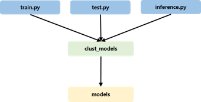

Clust: machine learning
=================================
Machine Learning 패키지는 Clustering, Regression, Classification, Anomaly Detection 등 모델의 생성 및 활용을 보여준다.
훈련을 위한 데이터 준비, 공통된 모듈 그리고 모델의 Train, Test, Inference 등 machine learning을 위한 코드들을 패키지와 해서 제공한다.

|

Machine Learning
----------------------------------------------------------

Structure
^^^^^^^^^^^^^^^^^^^^^^^^^^^^^^^^^^^^^^^^^^^^^^^^^
CLUST의 Machine Learning 패키지는 확장이 용이하고 유연한 모델 운영 및 관리를 위해 계층적 구조와 인터페이스를 구현하였다.
아래의 이미지와 같이 엔트리 포인트, 인터페이스 모델, 일반 모델로 구성되는 3계층 구조이며 화살표는 각 계층 클래스 간의 참조 방향을 의미한다.
모델 활용 목적에 따른 3종의 엔트리 포인트는 플랫폼 수준에서 관리되며, 모든 인터페이스 모델을 선택적으로 참조하여 활용한다.

.. figure:: ../image/machine_learning/ml_1.png
   :scale: 50%
   :alt: machine learning Structure
   :align: center
   :class: with-border

   machine learning Structure

<이미지 하나 더 추가>

Interface Models
^^^^^^^^^^^^^^^^^^^^^^^^^^^^^^^^^^^^^^^^^^^^^^^^
엔트리 포인트에 의해 참조되며 일반 모델 클래스를 참조하여 실질적인 모델 운용 로직을 구현한다.
일반적으로 통용되는 모델 클래스의 호환성 보장과 함께 인터페이스를 통해 엔트리 포인트 클래스와의 구현 종속성을 줄이기 위한 목적으로 도입한 계층이다.

모델 운용에 필수적인 메소드를 명시한 인터페이스를 준수하여 구현되어야 하며, 개발자 편의에 의한 추가 메서드 또한 구현 가능하다.

::

   class BaseRegressionModel(abc.ABC):

      @abc.abstractmethod
      def train(self) -> None:
         pass

      @abc.abstractmethod
      def test(self) -> Any:
         pass

      @abc.abstractmethod
      def inference(self) -> Any:
         pass

Model
^^^^^^^^^^^^^^^^^^^^^^^^^^^^^^^^^^^^^^^^^^^^^^^^^
Classification과 Regression에서 사용하는 Model은 'LSTM', 'GRU', 'CNN_1D', 'LSTM_FCNs', Anomaly Detection에서 사용하는 Model은 'AnomalyTransformer', 'RNN', 'ATTN'이다.

::

      def set_model(self, model_method, model_params):

         self.model_params = model_params

         if model_method == 'LSTM_rg' or model_method == 'GRU_rg':
            self.model = RNNClust(self.model_params)
         elif model_method == 'CNN_1D_rg':
            self.model = CNN1DClust(self.model_params)
         elif model_method == 'LSTM_FCNs_rg':
            self.model = LSTMFCNsClust(self.model_params)

<이미지 추가>

Pipeline
^^^^^^^^^^^^^^^^^^^^^^^^^^^^^^^^^^^^^^^^^^^^^^^^^^^^

<이미지 추가>

|

   machine learning Structure

|

Classification
----------------------------------------------------------

|

Regression
-----------------------------

|

Anomaly Detection
----------------------------------------------------------

|

Clustering
----------------------------------------------------------

Kmeans
^^^^^^^^^^^^^^^^^^^^^^^^^^^^^^^^^^^^^^^^^^^

Som
^^^^^^^^^^^^^^^^^^^^^^^^^^^^^^^^^^^^^^^^^^^^^

|

Tools
----------------------------------------------
데이터를 처리하고 Training, Test, Inference 등을 진행함에 있어 공통적으로 사용하는 함수들을 각 기능별로 모듈을 생성하였다.

.. list-table:: 
   :widths: auto
   :header-rows: 1

   * - List
     - Description

   * - Clean
     - NaN Data 제거

   * - Data
     - 데이터 출력, 분할, 변환 등 

   * - Meta
     - Meta Data 출력 및 저장

   * - Model
     - 학습된 모델 저장 및 출력

   * - Scaler
     - Data Scaling

   * - Util
     - 기타 변환 툴

|

Packages
-----------------------------

.. toctree::
   :maxdepth: 2
   
   ML/ML.anomaly_detection
   ML/ML.classification
   ML/ML.clustering
   ML/ML.common
   ML/ML.regression
   ML/ML.tool

