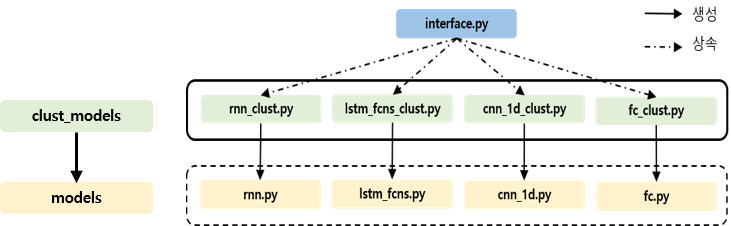
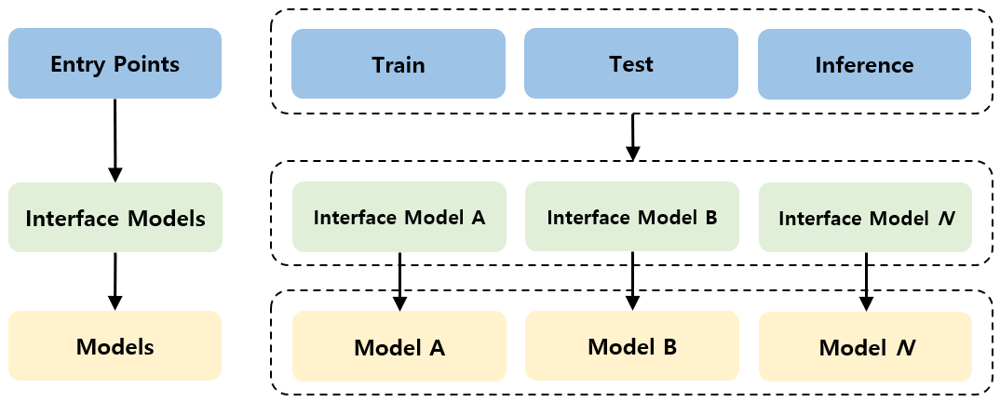
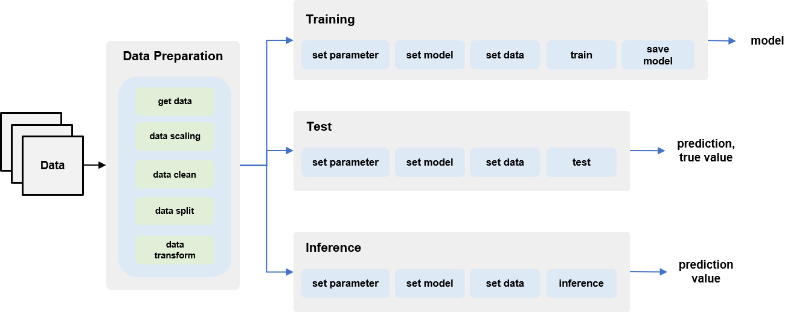
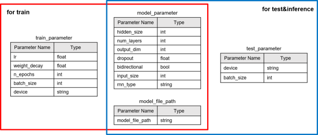
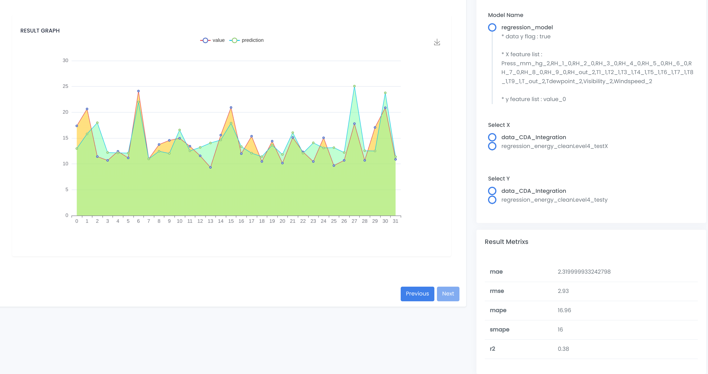

Clust: machine learning
=================================
Machine Learning 패키지는 Clustering, Regression, Classification, Anomaly Detection 등 모델의 생성 및 활용을 보여준다.
훈련을 위한 데이터 준비, 공통된 모듈 그리고 모델의 Train, Test, Inference 등 machine learning을 위한 코드들을 패키지와 해서 제공한다.

|

Machine Learning
----------------------------------------------------------

Structure
^^^^^^^^^^^^^^^^^^^^^^^^^^^^^^^^^^^^^^^^^^^^^^^^^
CLUST의 Machine Learning 패키지는 확장이 용이하고 유연한 모델 운영 및 관리를 위해 계층적 구조와 인터페이스를 구현하였다.
아래의 이미지와 같이 엔트리 포인트, 인터페이스 모델, 일반 모델로 구성되는 3계층 구조이며 화살표는 각 계층 클래스 간의 참조 방향을 의미한다.
모델 활용 목적에 따른 3종의 엔트리 포인트는 플랫폼 수준에서 관리되며, 모든 인터페이스 모델을 선택적으로 참조하여 활용한다.

   machine learning Structure

   machine learning Point

Interface
^^^^^^^^^^^^^^^^^^^^^^^^^^^^^^^^^^^^^^^^^^^^^^^^
엔트리 포인트에 의해 참조되며 일반 모델 클래스를 참조하여 실질적인 모델 운용 로직을 구현한다.
일반적으로 통용되는 모델 클래스의 호환성 보장과 함께 인터페이스를 통해 엔트리 포인트 클래스와의 구현 종속성을 줄이기 위한 목적으로 도입한 계층이다.

모델 운용에 필수적인 메소드를 명시한 인터페이스를 준수하여 구현되어야 하며, 개발자 편의에 의한 추가 메서드 또한 구현 가능하다.

::

   class BaseRegressionModel(abc.ABC):

      @abc.abstractmethod
      def train(self) -> None:
         pass

      @abc.abstractmethod
      def test(self) -> Any:
         pass

      @abc.abstractmethod
      def inference(self) -> Any:
         pass

   machine learning base & interface Model

Pipeline
^^^^^^^^^^^^^^^^^^^^^^^^^^^^^^^^^^^^^^^^^^^^^^^^^^^^
아래의 그림은 현재 Clust Machine Learning 패키지를 이용하여 모델 생성 및 활용하는 ``Pipeline`` 이다.
모델을 훈련시키기에 앞서 데이터를 정제, 스케일링, 변환 등 처리 작업을 진행한다.

|

   machine learning pipeline

|

Parameter
^^^^^^^^^^^^^^^^^^^^^^^^^^^^^^^^^^^^^^^^^^^^^^^^^^
Clust Machine Learning 패키지에서는 데이터 및 모델을 사용하기 위해서 각 정보를 담고 있는 메타 데이터가 필수적이다.

   machine learning parameter

|

Model
------------------------------------------------------

Model Selection
^^^^^^^^^^^^^^^^^^^^^^^^^^^^^^^^^^^^^^^^^^^^^^^^^
Classification과 Regression에서 사용하는 Model은 ``LSTM``, ``GRU``, ``CNN_1D``, ``LSTM_FCNs``, 
Anomaly Detection에서 사용하는 Model은 ``AnomalyTransformer``, ``RNN``, ``ATTN`` 등이 있다. Clustering은 대표적인 ``Kmeans`` 와 ``Som`` 을 사용한다.
아래의 코드는 ML의 Regression을 수행하기 위해 model을 선택하여 해당 모델의 정보를 가져오는 과정이다. 사용하는 Model만 다를 뿐, 사용하는 함수 및 플로우는 동일하다.

::

      def set_model(self, model_method, model_params):

         self.model_params = model_params

         if model_method == 'LSTM_rg' or model_method == 'GRU_rg':
            self.model = RNNClust(self.model_params)
         elif model_method == 'CNN_1D_rg':
            self.model = CNN1DClust(self.model_params)
         elif model_method == 'LSTM_FCNs_rg':
            self.model = LSTMFCNsClust(self.model_params)

Classification
^^^^^^^^^^^^^^^^^^^^^^^^^^^^^^^^^^^^^^^^^^^^^^^^^^^^^^^^^^^^^^
시계열 데이터의 분류(Classification) 타스크를 지원하며, 'CNN_1D', 'LSTM_FCNs', 'LSTM', 'GRU' 모델의 학습과 테스트, 추론을 수행할 수 있다. 
시계열 데이터의 분류는 시계열 데이터가 입력값으로 주어졌을 때 해당 데이터의 범주를 분류하는 타스크이다.

   Classification Test Result Example

Regression
^^^^^^^^^^^^^^^^^^^^^^^^^^^^^^^^^^^^^^^^^^^^^^^^^^^^^^^^^^^^^^
시계열 데이터의 회귀(Regression) 예측 타스크를 지원하며, 'CNN_1D', 'LSTM_FCNs', 'LSTM', 'GRU' 모델의 학습과 테스트, 추론을 수행할 수 있다. 
시계열 데이터의 예측 기술은 시계열 데이터가 입력 값으로 주어졌을 때, 해당 데이터의 패턴을 파악하도록 회귀 모델을 학습하여 미래의 데이터를 예측하는 타스크이다.

   Regression Test Result Example

Anomaly Detection
^^^^^^^^^^^^^^^^^^^^^^^^^^^^^^^^^^^^^^^^^^^^^^^^^^^^^^^^^^^^^^
시계열 데이터의 이상치 탐지(Anomaly Detection) 타스크를 지원하며, 'BeatGAN', 'LSTM_VAE', 'Anomaly Transformer'모델의 학습과 테스트, 추론을 수행할 수 있다.
시계열 데이터의 이상치 탐지는 시계열 데이터가 입력 값으로 주어졌을 때, 해당 시계열 데이터의 이상치 여부를 판단하는 타스크이다.

|

Clustering
-----------------------------------------------------------------------------------
군집화(Clustering)는 비지도 학습의 한 유형으로 유사한 특성이나 패턴을 가진 데이터를 그룹화하는 과정이다. 
주어진 데이터 집합을 서로 다른 그룹 또는 클러스터로 분할함으로써 데이터 내의 구조를 파악할 수 있다. 
이를 이용하여 데이터들의 패턴을 확인하고 있다.

K-means
^^^^^^^^^^^^^^^^^^^^^^^^^^^^^^^^^^^^^^^^^^^
K-means 알고리즘은 주어진 데이터를 K개의 클러스터로 그룹화하는 중심 기반 클러스터링 기법이다. 
K개의 중심을 기준으로 각 데이터 포인트를 가장 가까운 중심에 할당하며, 이렇게 할당된 데이터를 기반으로 새로운 중심을 계산한다. 
이 과정을 반복하여 클러스터 중심이 수렴할 때까지 진행한다.

Som
^^^^^^^^^^^^^^^^^^^^^^^^^^^^^^^^^^^^^^^^^^^^^
Som 알고리즘은 신경망 기반의 비지도 학습 알고리즘으로 고차원의 데이터를 저차원의 그리드에 매팽한다. 
초기에는 그리드에 뉴런들이 배치되고, 각 데이터 포인트는 그리드 상의 가장 가까운 뉴런에 패팅된다. 
학습 과정에서 가까운 뉴런을 비슷한 데이터에 조정하여 토폴로지를 보존하려 한다.

|

Tools
----------------------------------------------
데이터를 처리하고 Training, Test, Inference 등을 진행함에 있어 공통적으로 사용하는 함수들을 각 기능별로 모듈을 생성하였다.

.. list-table:: 
   :widths: auto
   :header-rows: 1

   * - List
     - Description

   * - Clean
     - NaN Data 제거

   * - Data
     - 데이터 출력, 분할, 변환 등 

   * - Meta
     - Meta Data 출력 및 저장

   * - Model
     - 학습된 모델 저장 및 출력

   * - Scaler
     - Data Scaling

   * - Util
     - 기타 변환 툴

|

Packages
-----------------------------

.. toctree::
   :maxdepth: 2
   
   ML/ML.anomaly_detection
   ML/ML.classification
   ML/ML.clustering
   ML/ML.common
   ML/ML.regression
   ML/ML.tool

