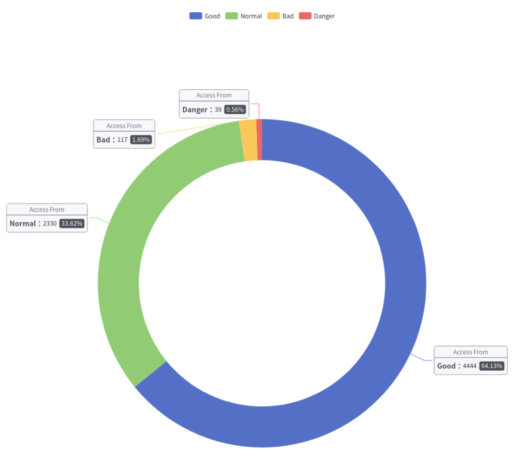
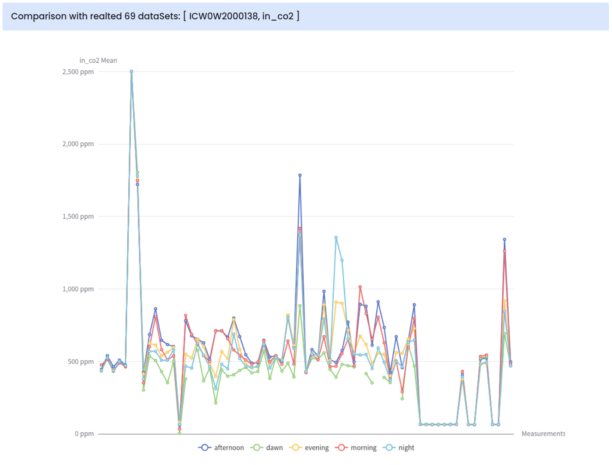
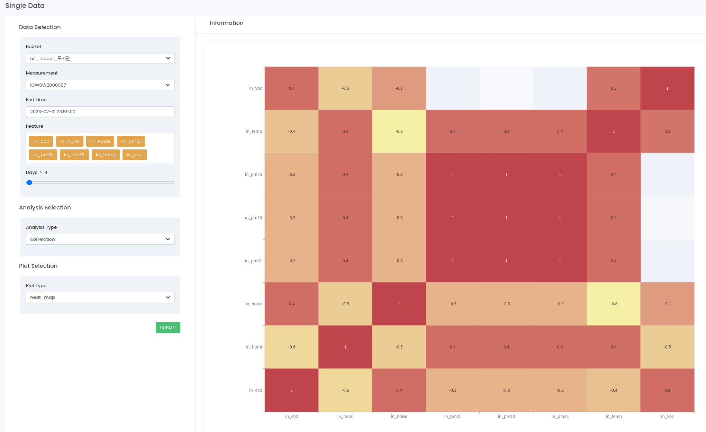
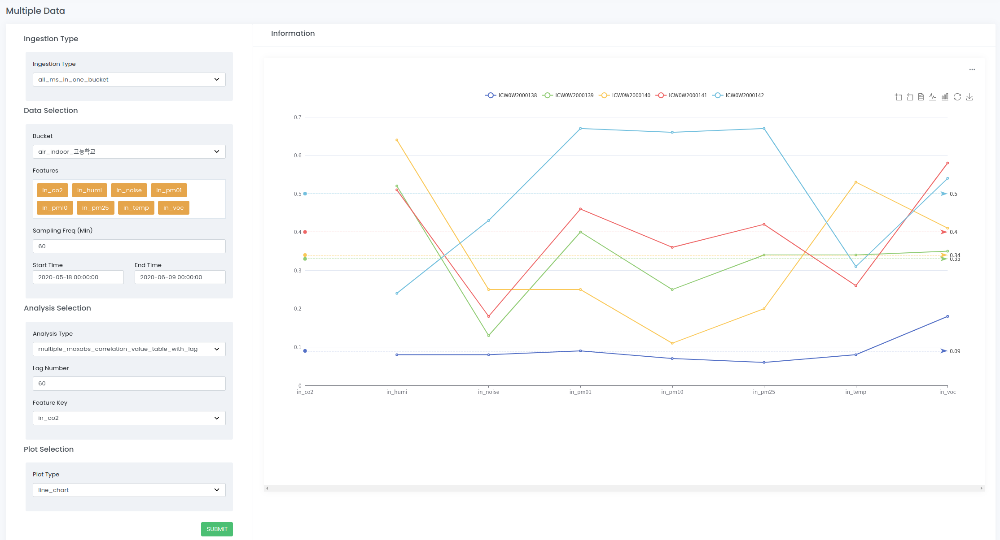

Clust: analysis
=================================
CLUST 플랫폼은 사용자가 시계열 데이터를 적극 활용할 수 있도록, 특정 방법 기준으로 데이터를 분석하는 여러 기능을 제공한다. 
이때 분석을 통하여 추출된 결과를 분석 메타라고 부르며,
Clust Analysis 패키지는 분석 메타 생성에 활용되는 도구로써 사용자 지정 파라미터에 의거한 기능들을 제공한다.

|

Analyzer
----------------------------------------------------------
Analyzer는 지정 라벨(Statistic Analyzer) 또는 지정 시간(Time Analyzer)에 따라 데이터를 분석하는 모듈들이다. 
분석 모듈로는 Statistic Analyzer, MeanByHoliday, MeanByWorking, MeanByTimeStep가 있으며, 
CLUST Platform은 각 모듈들을 활용하여 Feature exploration를 통해 분석 및 시각화 결과를 제공한다. 

Statistic Analyzer
^^^^^^^^^^^^^^^^^^^^^^^^^^^^^^^^^^^^^^^^^^^^^
Statistic Analyzer는 지정 라벨을 이용하여 시계열 데이터를 분석하는 모듈이다.
분석 기준과 분석된 정보를 활용하여 시각화 자료를 생성할 수 있다.

   [그림.Visual Result of Statistic Analyzer]

|

Time Analyzer
^^^^^^^^^^^^^^^^^^^^^^^^^^^^^^^^^^^^^^^^^^^^^
Time Analyzer는 시간 기준에 따라 시계열 데이터를 분석하는 모듈이다. 
시간 기준은 세 가지로, mean_by_holiday, mean_by_timeStep, mean_by_working 모듈로 분류된다. 
각 모듈은 분석 기준과 분석된 정보를 활용하여 시각화 자료를 생성할 수 있다.

- Features
   - mean_by_holiday : 평일, 휴일 기준으로 시계열 데이터를 분석
   - mean_by_timeStep : 지정 시간을 기준으로 분석
   - mean_by_working : 근무 시간 기준으로 분석

   [그림.Visual Result of mean_by_timeStep Time Analyzer]

|

Analysis Interface
----------------------------------------------------------
Analysis Interface는 사용자 지정 파라미터를 확인한 후, 
그에 따라 단일 데이터 또는 데이터셋 분석을 결정하는 인터페이스이다.
사용자 지정 파라미터에는 analysis_method와 analysis_param이 있다.

**Input Parameter Example**

- analysis_method : 분석 방법    
- analysis_param : analysis method에 따른 적절한 파라미터

::
       

    analysis_method = ["original", 'correlation', 'scaling', 'max_correlation_value_index_with_lag','scale_xy_frequency'] # dataframe input
    ['multiple_maxabs_correlation_value_table_with_lag', 'multiple_maxabs_correlation_index_table_with_lag'] # dictionary input  
          
    analysis_param = {'feature_key': 'PM10', 'lag_number': '24'} 
                       # max_correlation_value_index_with_lag
                       # multiple_maxabs_correlation_value_table_with_lag, 
                       # multiple_maxabs_correlation_index_table_with_lag
    #or                       
    analysis_param = {'lag_number': 24,'feature_key': 'CO2',
                       'time_scale': {'x_frequency': {'unit': 'H', 'num': 1}, 
                                     'y_frequency': {'unit': 'D', 'num': 1}}} # scale_xy_frequency
    

|

Bucket Report
----------------------------------------------------------
bucket 이름과 feature에 의거한 리포트 정보를 생성하는 모듈이다.

|

Data Analysis
----------------------------------------------------------
단일 데이터 또는 데이터셋 분석과 관련한 함수를 모아놓은 패키지이다.

Single Data Analysis
^^^^^^^^^^^^^^^^^^^^^^^^^^^^^^^^^^^^^^^^^^^^^
사용자 지정 파라미터에 의거하여 단일 데이터를 분석하는 기능이다. Clust EDA Single 메뉴에서 활용한다.

**Input Parameter Example**

- analysis_method : 분석 방법    

::
   
   analysis_method = ["original", 'correlation', 'scaling', 'max_correlation_value_index_with_lag','scale_xy_frequency']
    

   [그림.Single Data scaling 분석 시각화 결과]

DataSet Analysis
^^^^^^^^^^^^^^^^^^^^^^^^^^^^^^^^^^^^^^^^^^^^^
데이터셋을 분석하는 기능이다. Clust EDA Multiple 메뉴에서 활용한다.

**Input Parameter Example**

- analysis_method : 분석 방법    

::

   analysis_method = ['multiple_maxabs_correlation_value_table_with_lag', 'multiple_maxabs_correlation_index_table_with_lag']

   [그림. DataSet scaling 분석 시각화 결과]

   
|

Packages
-----------------------------

.. toctree::
   :maxdepth: 2

   analysis/analysis.statisticAnalyzer
   analysis/analysis.timeAnalyzer
   analysis/analysis.analysis_py
