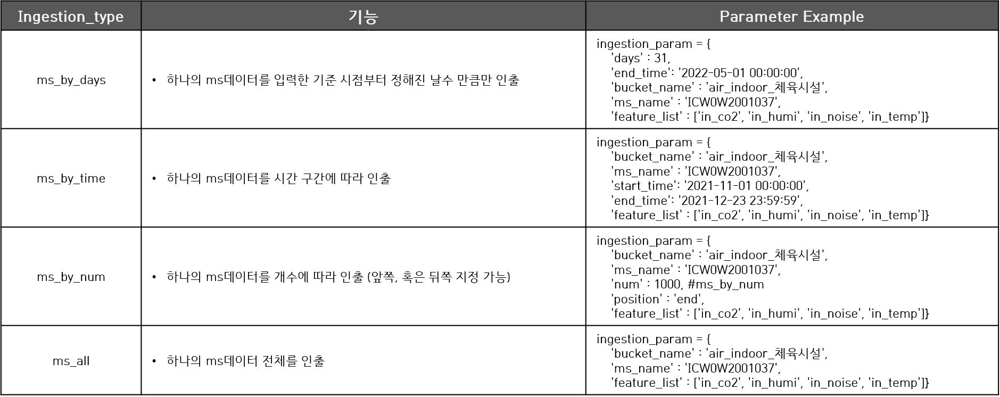
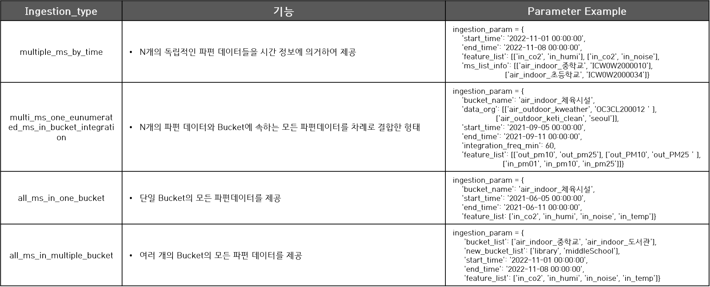
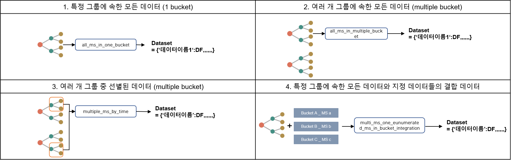

Clust : data
=================================

Interface
---------------------------------------------------------------
Ingestion type과 Ingestion Parameter에 따라 Dataframe 혹은 Dictionary 형태의 결과를 전달한다.

- Input : Ingestion_type, Ingestion_param, db_client
- Output : One Data(Dataframe), Multiple DataSet(Dictionary)

.. figure:: ../image/data/data_interface.png
   :scale: 60%
   :alt: data interface
   :align: center
   :class: with-border

   Data Interface

|

Data
----------------------------------------------------------
데이터를 가져오는 방법에는 Bucket안의 하나의 Measurement 데이터만 가져오거나 
하나 혹은 여러 Bucket에서 다중의 Measurement 데이터를 가져오는 두가지 방법이 있다.

Single Data
^^^^^^^^^^^^^^^^^^^^^^^^^^^^^^^^^^^^^^
Bucket안의 하나의 Measurement를 선택하여 정해진 날(days), 시간 구간(time), 개수(num) 또는 전체(all)에 따라 데이터를 선택적으로 가져온다.

|

Multiple Data
^^^^^^^^^^^^^^^^^^^^^^^^^^^^^^^^^^^^^^
하나의 Bucket안에 여러 Measurement 또는 여러 Bucket의 Measurement 등 N개의 다른 데이터들 선택하여 가져올 수 있다.

|

|

Packages
-----------------------------

.. toctree::
   :maxdepth: 2

   data/data