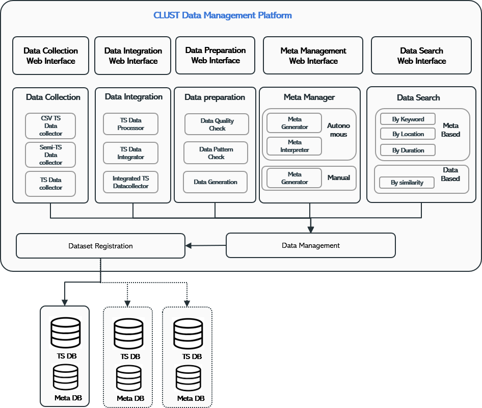

.. clust documentation master file, created by
   sphinx-quickstart on Fri Nov 11 11:42:37 2022.
   You can adapt this file completely to your liking, but it should at least
   contain the root `toctree` directive.

Introduction
=================================

What is Clust?
------------------------------
(clust에 대한 전반적인 설명)

(clust 구조 이미지 삽입)

|

CLUST PLATFORM
----------------------------
- `CLUST Data Analytics Platform <http://imrc-clust.keti.re.kr:20001/Index/>`_
- `CLUST Data Management Platform <http://imrc-clust.keti.re.kr:20002/>`_

(플랫폼 간단한 설명 추가?)

|

예시 코드
-------------------
| 예시 코드를 각 repository별로 간단하게 추가 시켜야하는가?
| 각 repository마다 꼭 필요한 부분이 있다면 그 부분 체크 필요

::
   
   example

|

CLUST PLATFORM
----------------------------
- `CLUST Data Analytics Platform <http://imrc-clust.keti.re.kr:20001/Index/>`_

.. image:: ../image/clust_cda.png
   :scale: 50%
   :alt: clsut cda platform
   :align: center

|

- `CLUST Data Management Platform <http://imrc-clust.keti.re.kr:20002/>`_

|

CLUST Repository
------------------------------------

.. toctree::
   :maxdepth: 1
   
   analysis
   ingestion
   integration
   meta
   ML
   preprocessing
   quality
   tool
   transformation
   data
   pipeline

