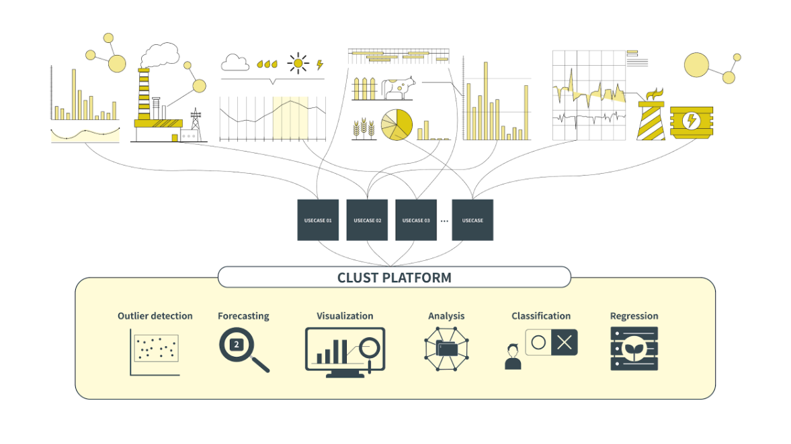
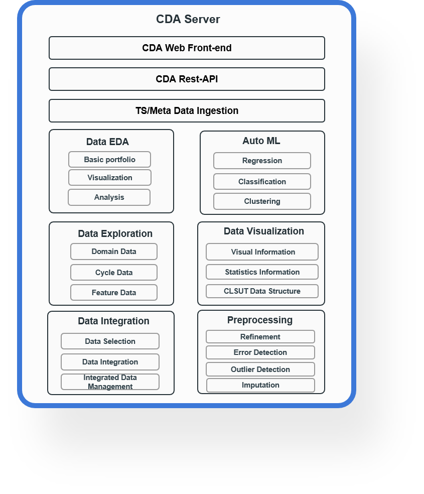
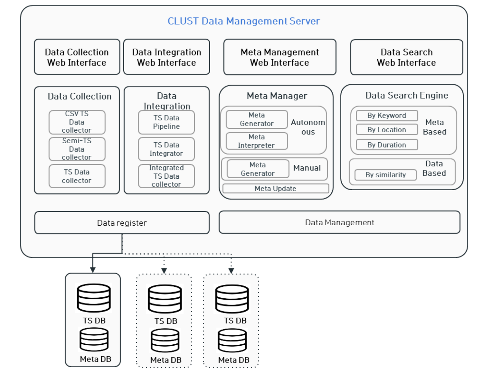

.. clust documentation master file, created by
   sphinx-quickstart on Fri Nov 11 11:42:37 2022.
   You can adapt this file completely to your liking, but it should at least
   contain the root `toctree` directive.

Introduction
=================================

What is Clust?
------------------------------
CLUST(CLUStering Technologies of fragmented data for time-based data analysis
|
시계열 데이터는 서로 다른 데이터 주기, 품질, 양, 길이, 저장 형식, 수집 및 활용 목적 등을 갖습니다. 그러므로 이질적인 다수의 시계열 데이터를 통합하여 분석하는 것은 단일 시계열 데이터를 분석하는 것 보다 더 어렵습니다. 
그러므로 CLUST 기술은 이와 같은 다수 시계열 데이터를 보다 쉽게 다루는 것을 목표로 개발되었습니다.

|

(clust 구조 이미지 삽입)

|

(대표 class & Function)

|

(예시 이미지)

|

CLUST PLATFORM
----------------------------
CLUST 기술을 이용하여 시계열 데이터를 시각화, 처리, 분석하는 플랫폼과 메타 데이터를 같이 활용하여 데이터를 생성, 처리, 출력 등 기술을 적용한 플랫폼 2가지를 소개한다.

   Clsut Platform

|

`CLUST Data Analytics Platform <http://imrc-clust.keti.re.kr:20001/Index/>`_
^^^^^^^^^^^^^^^^^^^^^^^^^^^^^^^^^^^^^^^^^^^^^^^^^^^^^^^^^^^^^^^^^^^^^^^^^^^^^^^^^^^^^^^^^^^^^^^
CDA(CLUST Data Analytics) 플랫폼은 복잡한 데이터셋에 대해 여러 각도로 분석할 수 있는 도구를 제공한다. 
사용자들은 하나의 인터페이스에서 손쉽게 데이터 추출, 분석, 데이터 시각화 처리를 할 수 있으며, 복합적 시간 데이터셋에서 직관적으로 통찰력을 얻을 수 있다.

   Clsut CDA Platform

`CLUST Data Management Platform <http://imrc-clust.keti.re.kr:20002/>`_
^^^^^^^^^^^^^^^^^^^^^^^^^^^^^^^^^^^^^^^^^^^^^^^^^^^^^^^^^^^^^^^^^^^^^^^^^^^^^^^^^^^^^^^^^^^^^^^
CDM(CLUST Data Management) 플랫폼은 시계열 데이터와 메타 데이터를 다루는 플랫폼으로, 사용자가 데이터 입력, 확인, 생성, 검색, 통합 처리 기술을 적용 가능한 기능을 제공한다.

   Clsut CDM Platform

|

CLUST Repository
------------------------------------

.. toctree::
   :maxdepth: 2
   
   analysis
   data
   ingestion
   integration
   meta
   ML
   pipeline
   preprocessing
   quality
   tool
   transformation

