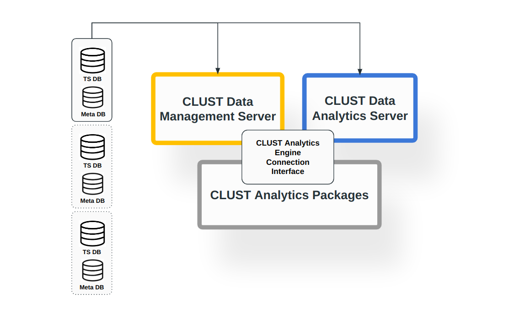
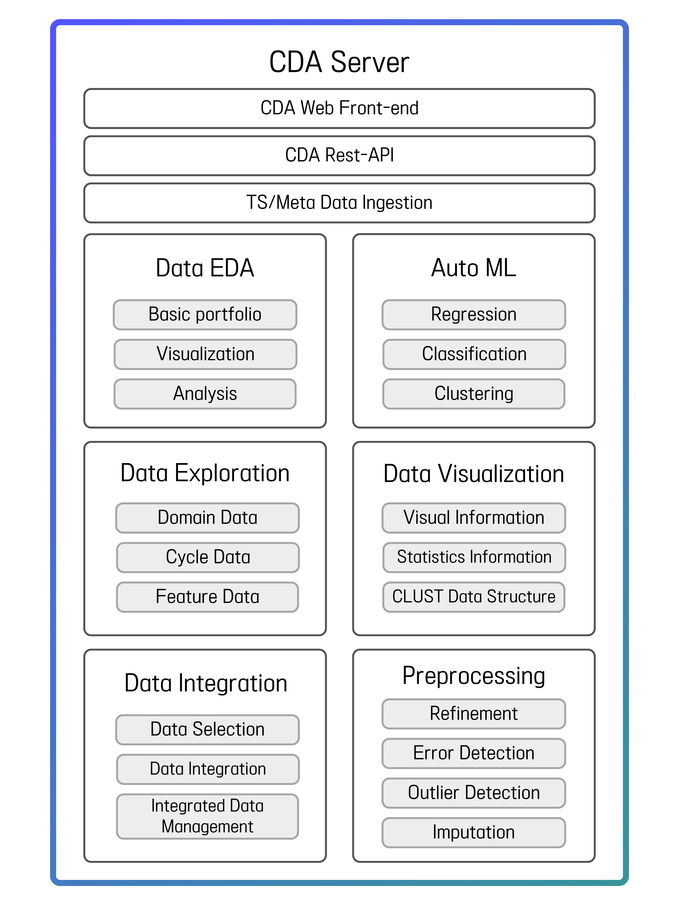
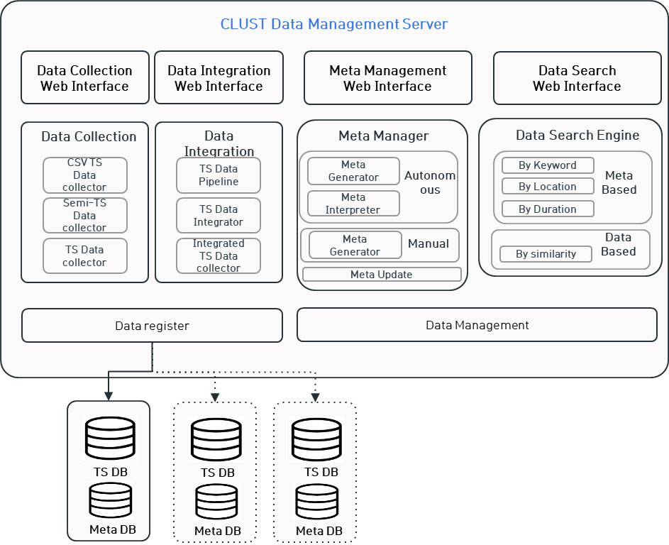

.. clust documentation master file, created by
   sphinx-quickstart on Fri Nov 11 11:42:37 2022.
   You can adapt this file completely to your liking, but it should at least
   contain the root `toctree` directive.

Introduction
=================================

What is Clust?
------------------------------
CLUST(CLUStering Technologies of fragmented data for time-based data analysis)

|

시계열 데이터는 서로 다른 데이터 주기, 품질, 양, 길이, 저장 형식, 수집 및 활용 목적 등을 갖는다. 그러므로 이질적인 다수의 시계열 데이터를 통합하여 분석하는 것은 단일 시계열 데이터를 분석하는 것 보다 더 어렵다. 그러므로 CLUST 기술은 이와 같은 다수 시계열 데이터를 보다 쉽게 다루는 것을 목표로 개발되었다.

|

   Clsut 

|

CLUST 플랫폼은 크게 두가지가 있다. 하나는 여러 소스의 데이터를 쉽게 찾고 통합하는 도구인 ``CLUST Data Management Server`` 이며, 다른 하나는 데이터를 탐색하는 기능을 제공하는 ``CLUST Data Analytics Server`` 이다. CLUST 플랫폼은 전문가가 아닌 사용자도 사용하기 쉬운 웹 인터페이스를 제공하며 다양한 시나리오에서 활용될 수 있습니다.CLUST 패키지는 두 서버에서 사용하는 모듈식 Python 패키지로 Github에서 공개되었다. CLUST Package는 다양한 형식과 품질로 저장된 여러 시계열 데이터를 활용하는 기능을 제공한다.

|

(Eng) Time series data have different data cycles, quality, quantity, length, storage format, collection and utilization purposes, etc. Therefore, integrating and analyzing multiple heterogeneous time series data is more difficult than analyzing a single time series data. Therefore, CLUST technology was developed with the goal of easier handling of such multiple time series data. There are two main CLUST platforms. One is CLUST Data Management Server, a tool to easily search and integrate data from multiple sources, and the other is CLUST Data Analytics Server, which provides the ability to explore data. The CLUST platform provides an easy-to-use web interface even for non-expert users and can be utilized in a variety of scenarios. The CLUST package is a modular Python package used on both servers and is published on GitHub. CLUST Package provides the ability to utilize multiple time series data stored in various formats and qualities.

|

CLUST PACKAGES
----------------------------
CLUST Packages는 분석, 데이터 인출 및 처리, 데이터 결합, 메타 생성, 데이터 처리, 데이터 품질 향상, 데이터 활용 도구, 데이터 변환, 기계학습 및 일련의 과정의 파이프라인 구성을 위한 소프트웨어를 제공한다. 해당 패키지는 Github에 공개되어 있으며 https://github.com/ClustProject/Clust 에서 확인할 수 있다. 본 홈페이지는 해당 소스코드에 대한 간단한 설명과 소개로 이루어진다.

CLUST PLATFORM
----------------------------
CLUST 기술을 이용하여 시계열 데이터를 시각화, 처리, 분석하는 플랫폼과 메타 데이터를 같이 활용하여 데이터를 생성, 처리, 출력 등 기술을 적용한 플랫폼 2가지를 소개한다.

   Clsut Platform

|

`CLUST Data Analytics Platform <http://imrc-clust.keti.re.kr:20001/Index/>`_
^^^^^^^^^^^^^^^^^^^^^^^^^^^^^^^^^^^^^^^^^^^^^^^^^^^^^^^^^^^^^^^^^^^^^^^^^^^^^^^^^^^^^^^^^^^^^^^
CDA(CLUST Data Analytics) 플랫폼은 복잡한 데이터셋에 대해 여러 각도로 분석할 수 있는 도구를 제공합니다. 사용자들은 하나의 인터페이스에서 손쉽게 데이터 추출, 분석, 데이터 시각화 처리를 할 수 있으며, 복합적 시간 데이터셋에서 직관적으로 통찰력을 얻을 수 있습니다.

   Clsut CDA Platform

`CLUST Data Management Platform <http://imrc-clust.keti.re.kr:20002/>`_
^^^^^^^^^^^^^^^^^^^^^^^^^^^^^^^^^^^^^^^^^^^^^^^^^^^^^^^^^^^^^^^^^^^^^^^^^^^^^^^^^^^^^^^^^^^^^^^
CDM(CLUST Data Management) 플랫폼은 시계열 데이터와 메타 데이터를 다루는 플랫폼으로, 사용자가 데이터 입력, 확인, 생성, 검색, 통합 처리 기술을 적용 가능한 기능을 제공합니다.

   Clsut CDM Platform

|

CLUST Repository
------------------------------------

.. toctree::
   :maxdepth: 2
   
   analysis
   data
   ingestion
   integration
   meta
   ML
   pipeline
   preprocessing
   quality
   tool
   transformation

