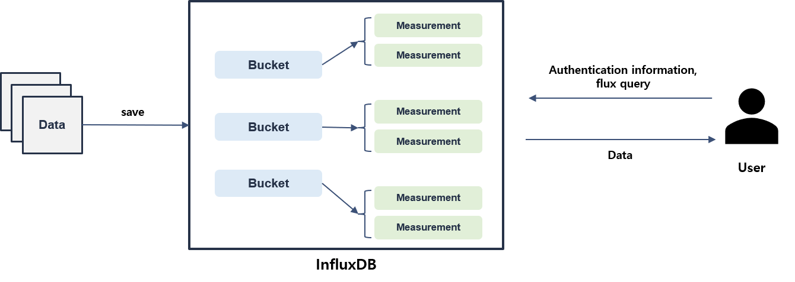
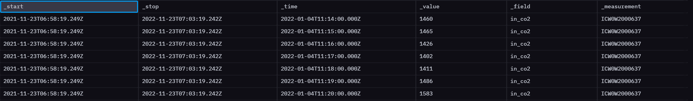
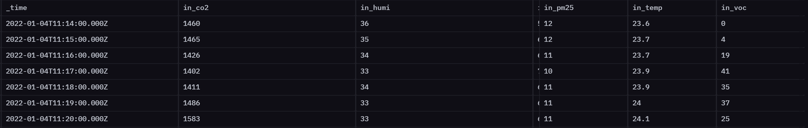
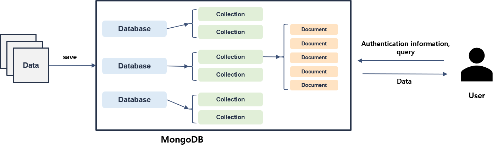

Clust: ingestion
=================================
해당 Repository는 Data Ingestion 기능들을 모아두었다.
현재 CLUST의 플랫폼 및 활용 코드에서 데이터 입출력을 위해 시계열 데이터를 저장하는 데이터베이스인 InfluxDB,
메타 정보를 저장하는 MongoDB를 사용하고 있다. 더하여 데이터를 주고 받을 때 많이 사용하는 CSV를 생성하거나 InfluxDB에 시계열 데이터 포멧으로
저장하는 방법들을 소개한다.

|

InfluxDB
---------------------------------
시간 특성을 가진 시계열 데이터의 효율적인 운용을 위하여 일반적인 RDB(Relational Database)가 아닌 시계열에 특화된 TSDB(Time Series Database)인 InfluxDB를 사용하였다.
시간 정보가 인덱스로 설정이 되어 있어 일반 데이터베이스를 사용했을 때보다 입출력에서 좋은 성능을 보여준다. 다만 일반적인 데이터베이스에서 수행하는 CURD가 모두 가능하지만 Create와 Read에 특화되어 있다.

Influx Ver.1
^^^^^^^^^^^^^^^^^^^^^^^^^^^^^^^^^^^^^^^^^^^
InfluxDB Ver.1은 Database, Measurement, Feature의 구조를 가지고 있으며, 일반적인 SQL Query와 유사한 InfluxQL를 사용하여 CRUD를 진행한다.

**InfluxQL**
::

   Example Query ==> select * from {ms_name}

**Authentication Information**
::

   Authentication={
         "host" : host,
         "port" : port,
         "user" : user,
         "password" : password
         }

|

Influx Ver.2
^^^^^^^^^^^^^^^^^^^^^^^^^^^^^^^^^^^^^^^^^^^^
InfluxDB Ver.2로 업그레이드 되면서 InfluxDB의 Query, Structure, Authentication 및 UI 통한 데이터 관리 등 여러 부분등이 변경되었다.

아래의 이미지는 InfluxDB의 구조이며, Bucket(Database)하위의 Measurement에 Data가 저장되며, User는 인증 정보 및 Query를 통해 데이터를 출력할 수 있다.

   InfluxDB 2.0 version Structure

**Flux Query**

기존의 ver.1과 가장 다른 ver.2의 부분은 Query이다. 새롭게 Flux Query를 사용하게 되면서 Query 구조 및 출력 포멧도 달라지게 되었다.
아래의 ``Original ver.2 View Raw Data`` 와 같이 _start, _stop, _field, _measuremt라는 컬럼을 기준으로 값이 출력이 된다.

::

   from(bucket:"bucket_name")
   |> range(start: start_time, stop: end_time)
   |> filter(fn: (r) => r._measurement == "measurement_name")

   Original ver.2 View Raw Data

**change result of Influx 2.x to Influx 1.x**

기존의 ver.1의 결과 및 일반적인 출력 형태로 만들어주기 위하여 아래의 Query를 추가하였다. 
그 결과 ``custom ver.2 View Raw Data`` 와 같이 각 Feature가 컬럼으로, _time이 시간 인덱스로 지정되면서 식별이 편한 형태로 결과가 출력된다.

::

   |> drop(columns: ["_start", "_stop", "_measurement"])
   |> pivot(rowKey:["_time"], columnKey: ["_field"], valueColumn: "_value")

   Custom ver.2 View Raw Data

**Authentication Information**
::

   Authentication={
         "url" : url,
         "token" : token,
         "org" : org
         }

|

MongoDB
----------------------------------
InfluxDB에 저장되는 Data와 트레이닝된 Model의 메타 정보를 저장하기 위하여 MongoDB를 사용하였다.
MongoDB는 NoSql구조로서 Database, colletion, document로 구성되어 있다. 

   MongoDB Structure

**Authentication Information**

::

   Authentication={
            "username" : username,
            "password" : password,
            "host" : host,
            "port" : port
            }

|

Save CSV Data
-----------------------------
- dataframe save to CSV
- CSV to dataframe

|

Packages
-----------------------------

.. toctree::
   :maxdepth: 2

   ingestion/ingestion.influx
   ingestion/ingestion.mongo
   ingestion/ingestion.DataToCSV
   ingestion/ingestion.CSVtoInflux
   ingestion/ingestion.interface
   