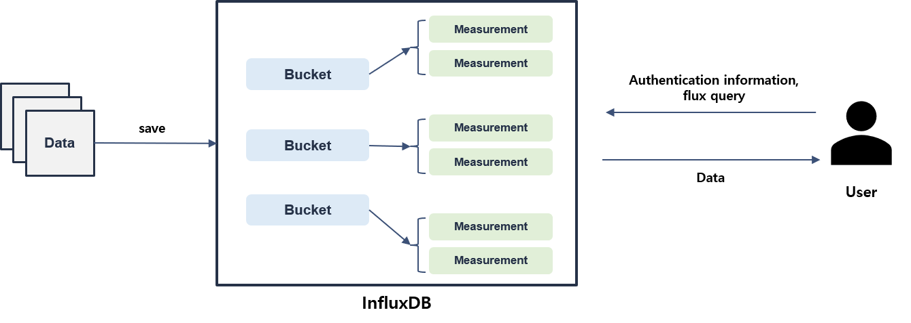
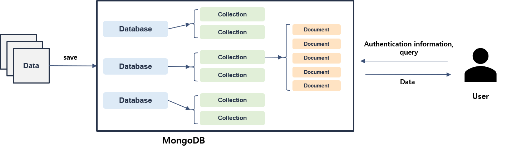

Clust: ingestion
=================================
해당 Repository는 Data Ingestion 기능들을 모아두었다.
CSV에서 추출한 데이터를 InfluxDB, MongoDB 또는 반대로 Database에 있는 데이터들을 CSV로 저장하는 기능들을 소개한다.

(기능별 설명)

(데이터베이스 or 현재 데이터 사용 구조 설명, 이미지)

|

InfluxDB
---------------------------------
 Authentication Information

::

   Authentication={
         "url" : url,
         "token" : token,
         "org" : org
         }

   

|

MongoDB
----------------------------------
 Authentication Information

::

   Authentication={
            "username" : username,
            "password" : password,
            "host" : host,
            "port" : port
            }

|

Packages
-----------------------------

.. toctree::
   :maxdepth: 2

   ingestion/ingestion.influx
   ingestion/ingestion.mongo
   ingestion/ingestion.DataToCSV
   ingestion/ingestion.CSVtoInflux
   ingestion/ingestion.interface
   