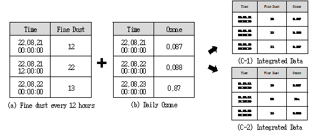
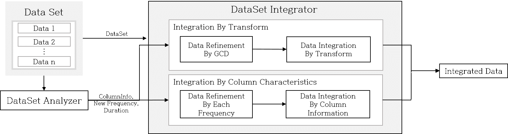

Clust: integration
=================================

Integration
-------------------------------------------------------

Purpose
^^^^^^^^^^^^^^^^^^^^^^^^^^^^^^^^^^^^^^^
시계열 데이터는 시간 정보를 기준으로 기록된 데이터로 시간 정보를 배제하고 활용하기는 어렵다. 
시계열 데이터가 기술된 시간 간격은 정보가 저장되는 시간차를 의미하며 시간 주기라고도 한다. 
다수의 시계열 데이터를 통합할 경우 시간 간격을 고려하지 않는다면 여러 문제점이 발생하기 때문에 통합하고 싶은 시계열 데이터의 각 기술된 시간 간격을 고려하여 섬세하게 통합 활용하여야 한다. 
아래 그림은 일정한 시간 주기를 기준으로 통합할 경우 데이터 정보를 손실하거나 (C-1), 혹은 결측 치 생성(C-2)으로 인한 성능 저하 초래되는 예를 보여준다.

   integration

Dataset Integrator
^^^^^^^^^^^^^^^^^^^^^^^^^^^^^^^^^^^^^^^^^^^
아래 그림은 CLUST에서 활용중인 Dataset Integrator 구조도이다.

   dataset integrator

서로 다른 특성을 갖는 N개의 데이터들의 통합 과정을 보여준다. 통합 순서는 아래와 같이 진행된다. 

   1. 서로 다른 N개의 시계열 데이터 입력
   2. 통합에서 요구되는 데이터 정보 분석 (DataSet Analyzer 활용)
   3. 2가지의 통합 방법 ( 데이터 특성 기반 통합 방법 (Integration By Column Characteristics), 차원 변환 기반 통합 방법 (Integration By Transform)) 중 선택하여 통합이 진행
   4. 통합 데이터 생성

|

Integration By Column Characteristic
^^^^^^^^^^^^^^^^^^^^^^^^^^^^^^^^^^^^^^^^^^^^^^^^^^^^^^

.. figure:: ../image/integration/integration_column_feature.png
   :scale: 50%
   :alt: integration_column_feature
   :align: center
   :class: with-border

   integration column feature

데이터 특성 기반 통합 방법은 데이터 변수 별 특성을 분석한 정보에 의거하여 업/다운 샘플링 방법을 활용한 데이터 재 표현을 통해 결측 치를 정리한 후 통합하는 방식이다. 
통합에 활용되는 데이터 변수별 특성 분석 정보는 변수의 시간 주기성이며 통합에 의해 발생하는 각각의 데이터에 대한 결측치를 처리하기 위해 업/다운을 결정하며 정해진 데이터 변수 유형에 따라 샘플링 방법을 선택한다. 

Integration By Transform
^^^^^^^^^^^^^^^^^^^^^^^^^^^^^^^^^^^^^^^^^^^^
해당 방식은 서로 다른 특성의 데이터 통합을 통해 규칙적인 주기로 조정함으로써 발생한 결함에 대해 차원을 변환하여 정돈된 시계열 통합 데이터를 생성하는 방식이다. 
해당 통합 방법은 통합 시 발생하는 결측 값을 두 가지 방법으로 채운 후 LSTM Autoencoder를 활용하여 기존 데이터들의 특징을 담고 있는 차원이 변환된 새로운 통합 데이터를 출력한다.

|

Integration Interface
--------------------------------------------------
integration_interface는 손쉬운 통합을 위해 활용하는 인터페이스로 비전문가가 데이터 통합하기 위한 도구를 제공한다. 
integration을 하는 type으로는 one_feature_based_integration과 multiple_dataset_integration 두가지 방법을 활용할 수 있다. 

|

one feature based integration
^^^^^^^^^^^^^^^^^^^^^^^^^^^^^^^^^^^^^^^
one_feature_based_integration 스타일로 데이터를 통합할 경우 특정 feature를 중심으로 해당 컬럼에 대해서만 결합한다. 
이 방법은 같은류의 데이터로 클러스터링 하기 위한 데이터셋을 만들떄 주로 활용된다. 
이때 duration 값이 있다면 해당 duration에 대해서만 데이터를 끊어 결합하며, duration이 없다면 시간 축이 같지 않더라도 무조건 결합한다.

::

   integration_type = 'one_feature_based_integration'

   integration_param = {
                     "duration": {'start_time': start_time , 'end_time': end_time},
                     "integration_frequency":timedelta_re_freq_min,
                     "feature_name": "in_co2" }

.. list-table:: 
   :widths: auto
   :header-rows: 1

   * - Parameter
     - Description

   * - Duration(start, end time)
     - 데이터 기간 설정

   * - integration_frequency
     - 데이터간의 시간 빈도 설정

   * - feature_name
     - 중심 컬럼 설정

|

multiple dataset integration
^^^^^^^^^^^^^^^^^^^^^^^^^^^^^^^^^^
multiple_dataset_integration 스타일로 데이터를 통합할 경우 무조건 각 데이터의 선택된 feature들을 시간의 축으로 결합한다. 
이 때 integration_param에 frequency가 지정된 경우엔 지정된 frequency를 중심으로 데이터를 변환하고 결합하고, 지정되지 않은 경우에는 최적의 frequency를 생성하고 이에 의거하여 데이터셋을 결합한다.

::

   integration_type = 'multiple_dataset_integration'

   integration_param = {
                     "integration_duration_type":"common",
                     "integration_frequency":timedelta_re_freq_min,
                     "param":{},
                     "method":"meta" }

.. list-table:: 
   :widths: auto
   :header-rows: 1

   * - Parameter
     - Description

   * - integration_duration_type
     - common 공통된 시간으로 합치기 / total 전체시간으로 합치기

   * - integration_frequency
     - 데이터간의 시간 빈도 설정

   * - param
     - method가 ML일 경우 transform_param을 추가하여 사용 / 일반적으로 빈칸

   * - method
     - 용도에 맞게 ['meta', 'ML', 'simple'] 선택하여 사용

   
|

integration by method
------------------------------------
여러 시계열 데이터에 대한 통합은 여러개의 방법을 차별적으로 적용해볼 수 있으며 이를 위해 CLUST는 integration_by_method 클래스를 활용한다. 
그에 따른 통합 방법에는 meta, ML, simple 방법이 있다.

meta
^^^^^^^^^^^^^^^^^^^^^^^^^^^^^^^^^^^^^^^
meta를 활용하는 방법은 위에서 설명한 “Integration By Column Characteristic” 방식으로 데이터를 통합하는 것이다.

ML
^^^^^^^^^^^^^^^^^^^^^^^^^^^^^^^^^^^^^^^
meta를 활용하는 방법은 위에서 설명한 “Integration By Transformc” 방식으로 데이터를 통합하는 것이다.

simple
^^^^^^^^^^^^^^^^^^^^^^^^^^^^^^^^^^^^^^^
simple방법은 단순한 up/down 샘플링으로 주기만 맞추어 여러개의 시계열 데이터를 통합하는 것을 나타낸다.

|

Packages
-----------------------------

.. toctree::
   :maxdepth: 2

   integration/integration.meta
   integration/integration.ML
   integration/integration.utils
   integration/integration.integration_py