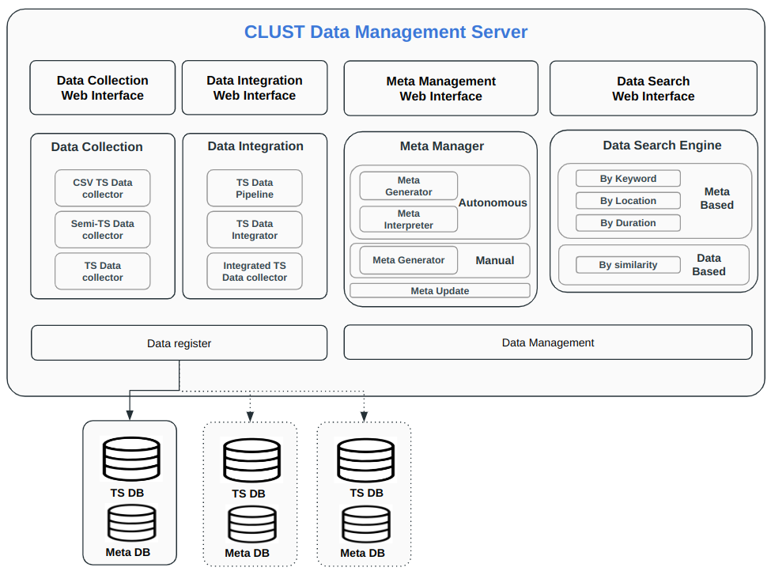

Clust: meta
=================================
시계열 데이터의 추가 정보인 Meta 데이터를 관리할 수 있는 기능들을 모아놓은 패키지이다. 주로 CLUST Data Management Server에서 활용된다.

   CLUST 메타 활용

|
metaFormatCheck
----------------------------------------------------------
Database에서 가져온 메타 정보가 CLUST에서 사용하는 규격에 맞는지 확인하는 기능을 제공한다.

metaInfo
^^^^^^^^^^^^^^^^^^^^^^^^^^^^^^^^^^^^^^^^^^^^^
- Bucket 메타를 확인한다.
- Measurement 메타를 확인한다.

|
metaDataManager
----------------------------------------------------------

bucketMeta
^^^^^^^^^^^^^^^^^^^^^^^^^^^^^^^^^^^^^^^^^^^^^
bucket메타 함수 관련 기능을 제공한다. (내용 수정 예정)

collector
^^^^^^^^^^^^^^^^^^^^^^^^^^^^^^^^^^^^^^^^^^^^^
mongoDB에서 데이터를 조회하는 함수들을 제공한다.

descriptor
^^^^^^^^^^^^^^^^^^^^^^^^^^^^^^^^^^^^^^^^^^^^^
mongoDB에 데이터를 입력하는 함수를 제공한다.

wizMongoDbApi
^^^^^^^^^^^^^^^^^^^^^^^^^^^^^^^^^^^^^^^^^^^^^
위즈온텍 제공 API 를 활용하여 메타 데이터를 관리하는 함수 패키지이다. (해당 패키지 삭제 예정)

|
metaGenerator
----------------------------------------------------------

analysisDBMetaGenerator
^^^^^^^^^^^^^^^^^^^^^^^^^^^^^^^^^^^^^^^^^^^^^
BK -분석 A 메타를 생성 관련 기능들을 제공한다. 특정 Bucket 하위에 존재하는 measurement들의 분석 정보를 수집하는 기능, 
measurement 분석 정보 평균값을 계산하는 기능, 최종 BK - 분석 A 메타를 생성하는 기능들이 있다.

analysisMSMetaGenerator
^^^^^^^^^^^^^^^^^^^^^^^^^^^^^^^^^^^^^^^^^^^^^
MS -분석 A 메타를 생성 관련 기능들을 제공한다. 분석 방법을 확인하는 기능, 분석 결과를 생성하는 기능들이 있다.

fileMetaGenerator
^^^^^^^^^^^^^^^^^^^^^^^^^^^^^^^^^^^^^^^^^^^^^
fileMetaInfo에 따라 file의 메타 정보를 읽고, 추가 메타를 생성하는 기능을 제공한다.

|
ingestion_meta_exploration
----------------------------------------------------------

ingestion_meta_exploration
^^^^^^^^^^^^^^^^^^^^^^^^^^^^^^^^^^^^^^^^^^^^^
메타 정보를 가져오는 기능을 제공한다.

|
Packages
-----------------------------

.. toctree::
   :maxdepth: 2

   meta/meta.metaFormatCheck
   meta/meta.metaDataManager
   meta/meta.metaGenerator
   meta/meta.ingestion_meta_exploration