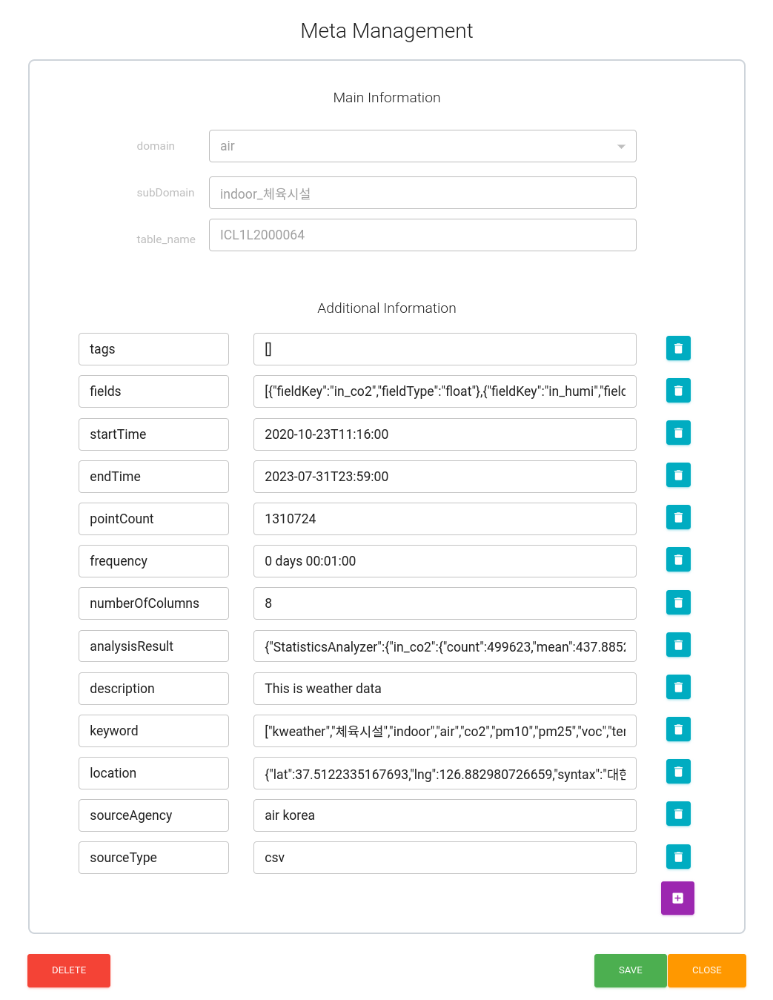
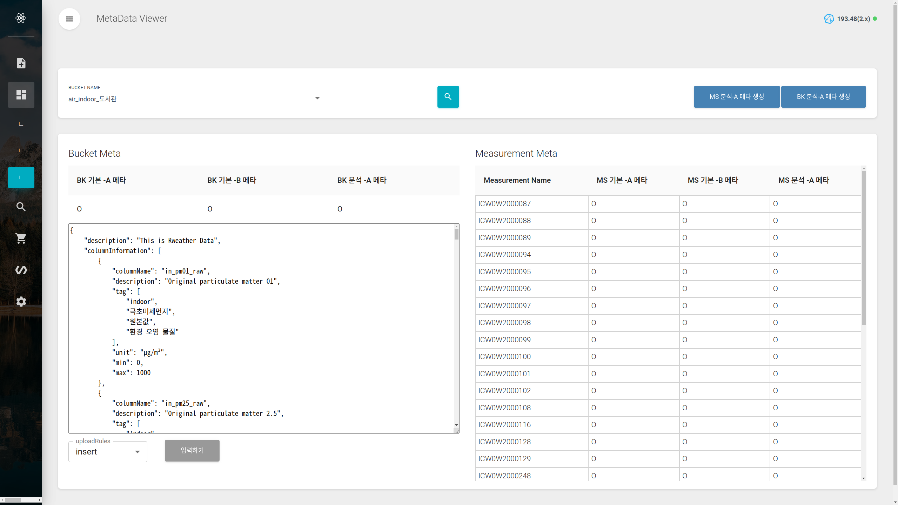

Clust: meta
=================================
시계열 데이터의 추가 정보인 Meta 데이터를 관리할 수 있는 기능들을 모아놓은 패키지이다. 주로 CLUST Data Management Server에서 활용한다.

|

.. figure:: ../image/meta/docs_meta_img.png
   :scale: 70%
   :alt: 이미지
   :align: center
   :class: with-border

   [그림. CLUST Data Management Server]

|

metaFormatCheck
----------------------------------------------------------
Database에서 가져온 메타 정보가 CLUST에서 사용하는 규격에 맞는지 확인하는 기능을 제공한다.

metaInfo
^^^^^^^^^^^^^^^^^^^^^^^^^^^^^^^^^^^^^^^^^^^^^
Bucket 메타와 Measurement 메타를 확인한다.

|

   [그림. CLUST 메타 데이터 정보 조회 화면]

|

metaDataManager
----------------------------------------------------------

bucketMeta
^^^^^^^^^^^^^^^^^^^^^^^^^^^^^^^^^^^^^^^^^^^^^
Bucket 데이터를 가져와 민맥스를 만들거나 업데이트하고 리턴하는 기능을 제공한다. 

collector
^^^^^^^^^^^^^^^^^^^^^^^^^^^^^^^^^^^^^^^^^^^^^
InfluxDB에서 필요한 데이터를 읽고 또 이를 전처리한 후 출력하거나, 
mongoDB에서 필요한 데이터를 조회하는 기능을 제공한다.

descriptor
^^^^^^^^^^^^^^^^^^^^^^^^^^^^^^^^^^^^^^^^^^^^^
mongoDB에 지정한 파라미터에 따라 데이터를 입력하는 함수를 제공한다.

wizMongoDbApi
^^^^^^^^^^^^^^^^^^^^^^^^^^^^^^^^^^^^^^^^^^^^^
위즈온텍 제공 API 를 활용하여 메타 데이터를 관리하는 함수 패키지이다. (해당 패키지 삭제 예정)

|

metaGenerator
----------------------------------------------------------

   [그림. metaGenerator를 활용하는 CLUST Platform]

analysisDBMetaGenerator
^^^^^^^^^^^^^^^^^^^^^^^^^^^^^^^^^^^^^^^^^^^^^
BK -분석 A 메타를 생성 관련 기능들을 제공한다.

- Features
   - 특정 Bucket 하위에 존재하는 measurement들의 분석 정보를 수집
   - measurement분석 정보의 평균값을 계산
   - BK -분석 A 메타를 생성

analysisMSMetaGenerator
^^^^^^^^^^^^^^^^^^^^^^^^^^^^^^^^^^^^^^^^^^^^^
MS -분석 A 메타를 생성 관련 기능들을 제공한다.

- Features
   - 사용자가 지정한 분석 방법을 확인
   - MS -분석 A 메타를 생성

fileMetaGenerator
^^^^^^^^^^^^^^^^^^^^^^^^^^^^^^^^^^^^^^^^^^^^^
fileMetaInfo에 따라 file의 메타 정보를 읽고 additional Meta가 있을 경우 추가 메타를 생성하는 기능을 제공한다.

|

ingestion_meta_exploration
----------------------------------------------------------
(get_meta_table은 구 버전에서 활용되는 듯함. 현재 사용하지 않는 기능으로 보임)

ingestion_meta_exploration
^^^^^^^^^^^^^^^^^^^^^^^^^^^^^^^^^^^^^^^^^^^^^
CLUST 고정 11개 도메인에 해당하는 메타 정보를 데이터 베이스에서 가져온다.

**고정 main domian list**

::

   main_domian_list =  ['air', 'farm', 'factory', 'bio', 'life', 'energy',
         'weather', 'city', 'traffic', 'culture', 'economy','INNER','OUTDOOR']

|

Packages
-----------------------------

.. toctree::
   :maxdepth: 2

   meta/meta.metaFormatCheck
   meta/meta.metaDataManager
   meta/meta.metaGenerator
   meta/meta.ingestion_meta_exploration