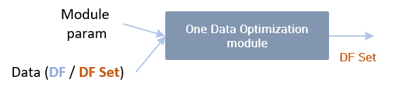
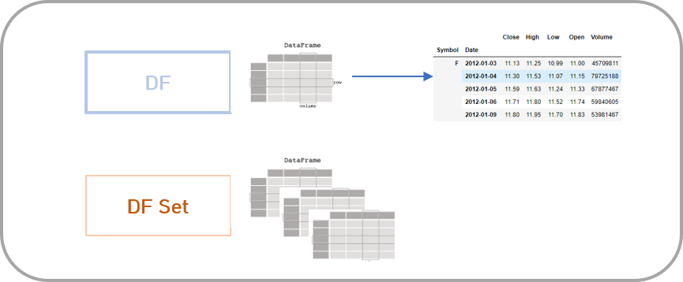
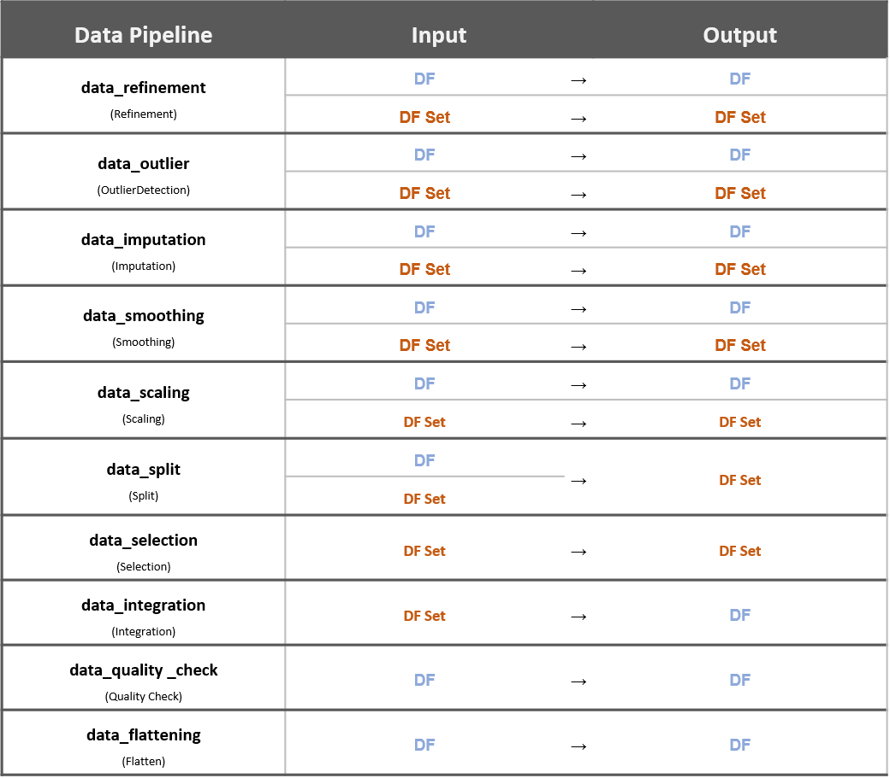
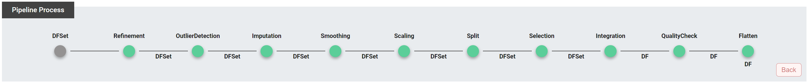

Clust: pipeline
=================================

Pipeline
-----------------------------------------------------

Purpose
^^^^^^^^^^^^^^^^^^^^^^^^^^^^^^^^^^^^^^^^^^
데이터 파이프라인은 CLUST에서 제공하는 주요 모듈을 pipeline을 활용해 랜덤한 순서로 쉽게 활용하기 위한 기능을 제공한다. 
원 데이터가 들어가면  파이프라인을 타고 데이터를 처리한 후 마지막 처리된 데이터를 제공한다. 
이때 현재 총 10가지 모듈을 활용할 수 있다.

   - DataPreprocessing-Refinement
   - DataPreprocessing-OutlierDetection
   - DataPreprocessing-Imputation
   - DataPreprocessing-Smoothing
   - DataPreprocessing-Scaling
   - Data-split
   - Data-Selection
   - Data-Integration
   - Data-Quality Check
   - Data-Flatten

.. figure:: ../image/pipeline/pipeline_module.png
   :scale: 50%
   :alt: pipeline module image 
   :align: center
   :class: with-border

   pipeline module

data optimization module input
^^^^^^^^^^^^^^^^^^^^^^^^^^^^^^^^^^^^^^^^^^
데이터 파이프라인을 활용하기 위해서는 데이터와 관련 모듈 파라미터를 입력으로 받아야 한다. 
각 데이터 처리 모듈은 1개의 데이터 혹은 다수의 데이터 혹은 그 두개 모두 받는 경우로 세가지 타입의로 정의 된다.

|

data optimization module input
^^^^^^^^^^^^^^^^^^^^^^^^^^^^^^^^^^^^^^^^^^
아래 표는 각 데이터 처리 모듈에 대한 인풋과 모듈에 대한 정의를 기술한 것이다. 
예를들어 data_refinement 모듈의 input은 데이터 프레임 (DF 1개 데이터)과 데이터 프레임 셋트 (DFSet, 다수 데이터)를 모두 받을 수 있으며 각 인풋의 포맷에 따라 같은 결과 포맷을 갖는다.

   pipeline Input Output Type

|

Use Case
------------------------------------

   pipeline manipulation

- Module 선택
   - 활용하고자 하는 Pipeline 모듈을 선택
   - 선택된 모듈에 대한 파라미터 값을 입력하여 전처리 값을 세부적으로 설정할 수 있음
   - 각 Module의 Input, Output 타입이 DF인지 DFSet인지 체크하면서 활용

- Pipeline Process Module
   - Refinement : 중복 제거, Frequency 설정
   - OutlierDetection : 이상치 제거
   - Imputation : 결측값 대체
   - Smoothing : 데이터 스무딩
   - Scaling : Scaling 적용 or 미적용
   - Split : Cycle 주기 설정
   - Selection : 키워드 생성
   - Integration : 데이터 Integration(one feature or mutiple dataset)
   - QualityCheck : NaN 개수에 따라 column 사용 및 삭제 여부 결정
   - Flatten : 데이터 프레임을 column이 하나인 단변량으로 변환

|

Parameter
--------------------------------------------

Default Parameter
^^^^^^^^^^^^^^^^^^^^^^^^^^^^^^^^^^^^^^^^^^
파이프라인을 사용하기 위한 모듈 파라미터들이다.

**Default Parameter**

::

   default_param = {
                  data_refinement, data_outlier, data_split, data_selection, data_integration,
                  data_quality_check, data_imputation, data_smoothing, data_scaling }

Pipeline Parameter
^^^^^^^^^^^^^^^^^^^^^^^^^^^^^^^^^^^^^^^^^^^^^^
파이프라인의 각 모듈에 필요한 파라미터들이다. 각 모듈에서 공통적으로 사용하는 ``flag`` 값은 모듈의 각 파라미터 과정을 실행할 지, 실행하지 않고 넘어갈 지 선택하는 변수다.

**Refine Parameter**

::

   data_refinement = { "remove_duplication": {'flag': True}, 
                       "static_frequency": {'flag': True, 'frequency': refine_frequency} }

**Oulier Parameter**

::

   data_outlier = { "certain_error_to_NaN": {'flag': True }, 
                    "uncertain_error_to_NaN":{'flag': False} }

**Split Parameter**

::

   data_split = { "split_method":"cycle",
                  "split_param":{ 'feature_cycle' : "Day",
                                  'feature_cycle_times' : 1} }

**Selection Parameter**

::

   data_selection = { "select_method":"keyword_data_selection", 
                      "select_param":{ "keyword":"*"} }

**Integration Parameter**

::

   data_integration = { "integration_param":{"feature_name":"in_co2", "duration":None, "integration_frequency":integration_frequency},
                        "integration_type": "one_feature_based_integration" }

**Quality Parameter**

::

   data_quality_check = { "quality_method" : "data_with_clean_feature", 
                          "quality_param" : { 
                                 "nan_processing_param":{
                                                      type':"num", 
                                                      'ConsecutiveNanLimit':4, 
                                                      'totalNaNLimit':24} } }

**Imputation Parameter**

::

   data_imputation = {  "flag":True,
                        "imputation_method":[{"min":0,"max":300,"method":"linear", "parameter":{}}, 
                                            {"min":0,"max":10000,"method":"mean", "parameter":{}}],
                        "total_non_NaN_ratio":1 }

**Smoothing Parameter**

::

   data_smoothing = {'flag': True, 'emw_param':0.3}

**Scaling Parameter**

::

   data_scaling = {'flag': True, 'method':'minmax'} 

|

Packages
-----------------------------

.. toctree::
   :maxdepth: 2

   pipeline/pipeline.pipeline_py

