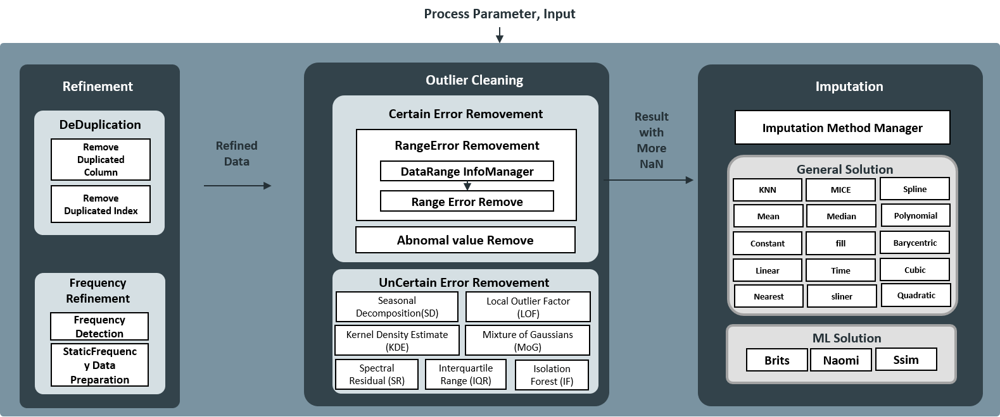
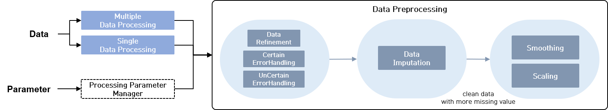

Clust: preprocessing
=================================
preprocessing 전처리 패키지는 불규칙한 데이터의 기술 문제를 해결하고 에러 데이터를 제거한다.
또한 유실된 데이터에 대해서는 파라미터에 의거하여 필요한 만큼만 유실 데이터를 보완할 수 있도록 한다.

|

Preprocessing
-------------------------------

preprocessing module
^^^^^^^^^^^^^^^^^^^^^^^^^^^^^^^^^^^^^^^^^

   preprocessing module

|

Preprocessing Pipeline
^^^^^^^^^^^^^^^^^^^^^^^^^^^^^^^^^^^^^^^^^
시계열 데이터 처리 파이프라인은 데이터를 활용하고자 하는 목적에 따라 서로 다른 파이프라인 흐름을 활용해야 한다.
아래 그림은 전처리 파이프라인이 활용될 수 있는 어플리케이션에 대한 데이터 흐름도를 나타낸다.
데이터는 하나의 데이터 혹은 여러 개의 데이터 묶음에 대해서 일괄 처리가 가능하다. 데이터 전처리는 파라미터의 기술 내용에 따라 취사 선택하여 활용된다.
만약 데이터 전처리 파라미터가 정의되지 않은 경우 processing parameter를 생성하는 함수를 통해 자동으로 생성이 가능하다.

   preprocessing pipeline

|

Preprocessing Interface
^^^^^^^^^^^^^^^^^^^^^^^^^^^^^^^^^^^^^^^^^
전처리를 쉽게 처리하기 위한 대표 인터페이스를 활용한다. 주요 함수는 ``processing_interface.get_data_result()`` 다.
저장 목적과 조건이 서로 다른 시계열 데이터를 일괄 처리할 수 있는 전처리 모듈을 제공하며, 각 모듈들은 개별 혹은 결합된 형태로 데이터를 처리할 수 있게 설계되었다.
Input Parameter는 ``processing_type`` , ``param`` , ``data`` 로 이루어져있으며 함수의 각 전처리 모듈을 거친 후, Dataframe 형태의 ``result`` 를 반환한다.
``processing_type`` 을 통해 수행할 전처리 모듈은 선택할 수 있다.

.. function:: processing_interface.get_data_result(processing_type, param, data)

``processing_type`` 을 통해 수행할 전처리 모듈을 선택할 수 있다.

**processing_type**

::

   ['refinement'|'error_to_NaN'|'certain_error_to_NaN'|
    'uncertain_error_to_NaN'|'imputation'|'step_3'|'smoothing'|'scaling']

.. list-table:: 
   :widths: auto
   :header-rows: 1

   * - processing_type
     - Description

   * - refinement
     - 데이터의 정제를 수행함

   * - error_to_NaN
     - 에러 값으로 판별되면 정의되지 않은 값으로 바꿈

   * - certain_error_to_NaN
     - 확실한 에러 값으로 판별되면 유실 데이터 처리함 

   * - uncertain_error_to_NaN
     - 불확실한 에러 값이라도 파라미터에 의해 에러 값으로 판별되면 유실 데이터 처리함 

   * - imputation
     - 유실 값에 대한 보완을 처리함 

   * - step3
     - refinement -> error_to_NaN -> imputation 과정을 모두 수행함

   * - smoothing
     - 데이터의 노이즈를 제거하거나 평탄화 하기 위함

   * - scaling
     - 스케일링 기법을 통해 데이터를 표준화

|

Error Detection
--------------------------------

Certain Error
^^^^^^^^^^^^^^^^^^^^^^^^^^^^^^^^^^^^^
시계열 데이터 상 확실한 에러 데이터에 대해서만 제거한다. 각 Feature별 데이터 존재 가능 범위 밖의 데이터나 불필요하게 반복되는 데이터를 삭제하는데 유용하게 사용이 가능하다.

- Features
   - 유효구간 내부의 데이터만 판별
   - 특정 에러 값에 대해 데이터 처리 가능하도록 Python 해석 가능한 NaN으로 표기
   - 해당 함수를 거치면 Error라고 판별한 데이터가 NaN으로 변경되기 때문에 Input보다 더 많은 NaN 데이터가 발생

**Certain Parameter Example**

::
  
  if certain_param['flag']:
    certain_param['abnormal_value_list'] = {'all':[99.9, 199.9, 299.9, 9999, -99.9, -199.9, -299.9, -9999, -9999.0]} 
    certain_param['data_min_max_limit']  = { 'max_num': {
          'in_temp': 80,
          'in_humi': 100,
          'in_co2': 10000,
          'in_voc': 60000,
          'in_noise': 90,
          'in_pm10': 1000,
          'in_pm25': 1000,
          'in_pm01': 1000},
          'min_num': {'in_temp': -40,
          'in_humi': 0,
          'in_co2': 0,
          'in_voc': 0,
          'in_noise': 35,
          'in_pm10': 0,
          'in_pm25': 0,
          'in_pm01': 0}}

UnCertain Error
^^^^^^^^^^^^^^^^^^^^^^^^^^^^^^^^^^^^^
데이터의 흐름과트렌드, 통계적 정보를 고려할 때, 에어로 판단될 수 있는 값들을 제거한다.

- Features
   - 불특정한 튀는 값에 대해서 파라미터에 의거하여 에로러 판별하고 NaN으로 표기
   - 확실한 NaN 값이 아닌, 불확실한 값까지 Outlier로 처리할 수 있으므로 신중하게 파라미터를 선택해야함
   - 해당 함수를 거치면 Error라고 판별한 데이터가 NaN으로 변경되기 때문에 Input보다 더 많은 NaN 데이터가 발생

**Uncertain Parameter** 

::

   uncertain_param = {
      'flag': True, 
      "param": {
              "outlierDetectorConfig": [ {'algorithm': 'IQR', 'percentile': 99,'alg_parameter': {'weight': 100} } ]
              }
      }

**Outlier Detection Algorithm** 

.. list-table:: 
   :widths: auto
   :header-rows: 1

   * - Algorithm
     - Description

   * - Spectral Residual(SR)
     - 데이터의 일반적인 특징이 아닌 local 영역의 특이한 점을 탐색하며 갑작스런 변화에 민감하게 반응하는 전처리 모듈

   * - Mixture of Gaussian Density Estimation(MoG)
     - 추정된 정상 데이터의 분포에서 낮은 확률 값을 가지는 데이터를 Outlier로 탐지

   * - Local Outlier Factor(LOF)
     - 주변 이웃들과의 거리를 통한 밀도를 계산하고 낮은 밀도의 데이터를 Outlier로 탐지

   * - Kernel Density Estimator(KDE)
     - Kernel을 이용한 Non Parametric Estimator

   * - Isolation Forest(IF)
     - Tree 재귀적 분할에 의한 알고리즘

   * - Interquartile Range(IQR)
     - 데이터의 통계적 분포를 간단히 계산하여 이에 벗어난 값에 대해 이상치 탐지

   * - Seasonal Decompotision(SD)
     - 트랜드, 계절성 등을 고려하여 Residual Signal 값을 계산하고 이에 의거하여 Outlier 탐지

|

Refinement
-------------------------------------
Refinement는 데이터를 균일하게 하는 모든 전처리 과정을 진행한다. 
중복된 데이터가 있거나, 데이터 중간에 유실 구간이 있는데 이를 처리하지 않은 채로 분석 및 모델링을 한다면 오류 데이터가 정상 데이터로 간주되게 되어 데이터가 편향된다. 
제안하는 Refinement는 여러 문재로 인해 생긴 중복된 군더더기 데이터를 삭제하고, 데이터가 없는 구간에 대한 시간 스탬프를 원하는 시간 주기로 기술하여 사건에 따른 데이터의 표현을 명확하게 한다.
원 데이터보다 유실 처리한 데이터가 많아지더라도 시간에 따른 데이터의 표현은 더욱 명확해질 수 있다.

- Feature
   - 파라미터 기반 데이터 정리
   - 중복 데이터 제거
   - 데이터의 기술 간격의 불규칙성을 균일하게 조정
   - 시간 순차적으로 데이터 재배열
   - 기타 데이터 클린징을 수행

**Refinement Parameter** 

::

   refine_param = {
      "remove_duplication": {'flag': True}, 
      "static_frequency": {'flag': True, 'frequency': None}
      }

.. list-table:: 
   :widths: auto
   :header-rows: 1

   * - refine_param
     - Description

   * - remove_duplication
     - 중복 값 제거 및 윤일한 시간 인덱스를 데이터 반환 

   * - static_frequency
     - 설정한 시간 정보를 기반으로 데이터 변경

|

Imputation
-----------------------------------
유실 데이터에 대해서 보완하는 모듈로 연속된 에러의 길이가 짧거나 긴 구간에 대해 적층적으로 처리할 수 있도록 구성하였다.
시계열 데이터를 활용하기에 앞서 존재하는 유실 데이터 전체를 보완하게 되면 활용하는 단계의 데이터가 활용하기 이전의 데이터와 달리 정상 데이터로 인식할 수 있는 문제점이 있다.
따라서, 해당 Imputation에서 파라미터로 조건을 기입 받아 보완 정도를 조절한다.

- Features
   - 사용자가 정의한 범위에 해당하는 필수 NaN 데이터에 대해서만 처리하고 보완
   - 장기간 연속된 유실 값을 갖는 데이터에 대해서는 사용자 파라미터를 기반하여 보완 진행 여부 결정
   - 보완 알고리즘과 이를 적용할 데이터 범위 결정 가능
   - 다수의 알고리즘을 동시에 순차적으로 적용 가능

**Inputation Parameter**

::

   imputation_param = {
      "flag": True,
      "imputation_method": [{"min": 0, "max": 100, "method": "linear", "parameter": {}}],
      "totalNonNanRatio": 90
      }

.. list-table:: 
   :widths: auto
   :header-rows: 1

   * - imputation_param
     - Description

   * - flag
     - Imputation에 대한 수행 여부 판단 

   * - imputation_method
     - 연속되는 에러의 길이에 따라 Imputation 방법 지정 

   * - totalNonNanRatio
     - Imputation 보완 정도를 결정 / %값 사용 및 설정 값 이상의 NaN 존재시, 진행X 

|

|

Packages
---------------------

.. toctree::
   :maxdepth: 2

   preprocessing/preprocessing.errorDetection
   preprocessing/preprocessing.imputation
   preprocessing/preprocessing.refinement
   preprocessing/preprocessing.preprocessing_py