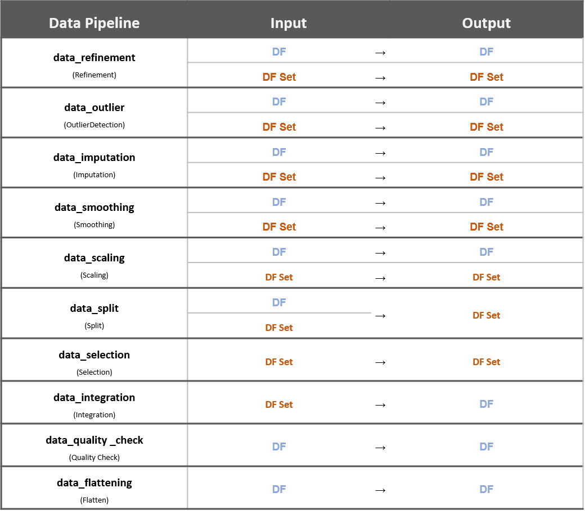

Clust: quality
=================================

Quality
------------------------------------------------

Purpose
^^^^^^^^^^^^^^^^^^^^^^^^^^^^^^^^^^^^^^^^^^
시계열 데이터는 특성상 많은 오류를 포함하고 있다. 그러나 이러한 오류나 유실값을 포함한 데이터를 무조건 복구하여 활용할 경우 데이터의 품질이 매우 떨어지게 된다. 
N개의 데이터가 각각 피쳐 f개, 시간 index M개로 이루어졌다고 가정해보자. (total data size = N x f x M)

CLUST 플랫폼에서는 크게 세가지 모듈을 활용하여 데이터의 품질을 측정 및 복구한다. 

   1. 이상수치에 대한 NaN 데이터화 모듈은 이상수치이지만 이상수치가 아닌 쓰레기 값을 갖고 있는 데이터를 인지하여 NaN으로 다시 바꾼다. 비교적 명확한 이상 측정 값의 의미를 제거하기 위해 값을 NaN으로 변경하며, 기존 NaN 값과 함께 최대 NaN 값으로 변환한다.
   2. NaN Status에 따른 데이터 삭제 모듈은 유실 값의 상태에 따라 데이터를 활용할 것인지 아닌지를 판별한다. 최대 NaN 수치를 포함한 데이터에 대해서 Feature를 기준으로 데이터를 삭제하여 imputation할 의미가 없는 오염이 심한 데이터들을 골라내어 제거한다. 기존 방법은 전체 데이터를 복구 혹은 전체 데이러를 활용하지 않는 방법을 적용한다. 
   3. 파라미터 기반 NaN imputation은 유실 값의 상황을 보고 적당한 선까지만 복구를 진행한다. 기존의 방법은 보통 일방적인 Imputation을 일괄 적용한다. 파라미터 기반 NaN Data imputation을 실행하여 가능성이 있는 데이터들을 복구하는 역할을 수행한다.

use-case
^^^^^^^^^^^^^^^^^^^^^^^^^^^^^^^^^^^^^^^^^^

   pipeline Input Output Type

CLUST:quality 패키지는 이중 NaN Status에 따른 데이터 삭제 모듈에 해당하며 이를 위한 기능을 제공하고 있다. 
위에서 설명한 세가지 모듈은 그림과 같이 두가지 플로우 적용될 수 있는데 각각의 장단점은 아래와 같다.

(상단 플로우)
   - 장점: imputation이 필요 없는 데이터를 미리 제거하여 속도를 높일 수 있음
   - 단점: imputation의 파라미터 조절로 복구할 수 있는 데이터를 미리 제거하기 때문에 전체 복구할 수 있는 데이터 양이 줄어듦

(하단 플로우)
   - 장점: 상단 방법에 비해 더 많은 데이터를 살려낼 수 있는 확률이 높음
   - 단점: 많은 데이터에대해서 Imputation 모듈을 먼저 수행하고 최종적으로 제거할 데이터를 결정하기 떄문에 계산량이 높음

clean feature data
^^^^^^^^^^^^^^^^^^^^^^^^^^^^^^^^^^^^^^^^^^
clean_feature_data는 특정 데이터 컬럼이 어느 이상 품질에 해당하지 못할 경우 해당 feature만 삭제하는 기능을 제공한다.

data remove by NaN
^^^^^^^^^^^^^^^^^^^^^^^^^^^^^^^^^^^^^^^^^^
데이터를 NaN의 상황에 의해 평가하는 클래스로 time (어느 길이의 시간 만큼을 기준할 것인지), 
num (어느 갯수만큼을 기준으로 할 것인지), 
ratio(전체 데이터에 대해 어느 포션 만큼을 기준으로 할 것인지)에 따라 그 기준을 둘 수 있다. 
해당 기준에 따라 그 기준을 통과하는 데이터에 대한 남기는 실질적인 역할을 수행하는 클래스이다.

|

quality interface
----------------------------------
현재 interface에서 제공하는 방법은 data_with_clean_feature에 의한 데이터 클리닝 방법만 제공하고 있다. 
즉 특정 데이터 컬럼이 세심한 복구 (사용자의 지정에 의한)에도 불구하고 기준에 부합하지 못한다면 해당 feature를 삭제한다.

|

Packages
-----------------------------

.. toctree::
   :maxdepth: 2

   quality/quality.NaN
   quality/quality.quality_interface