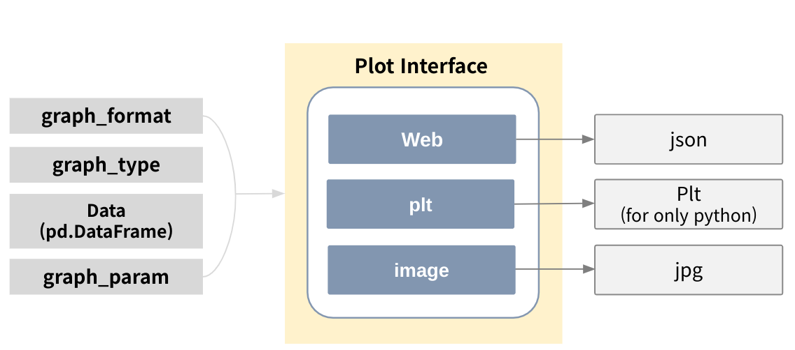
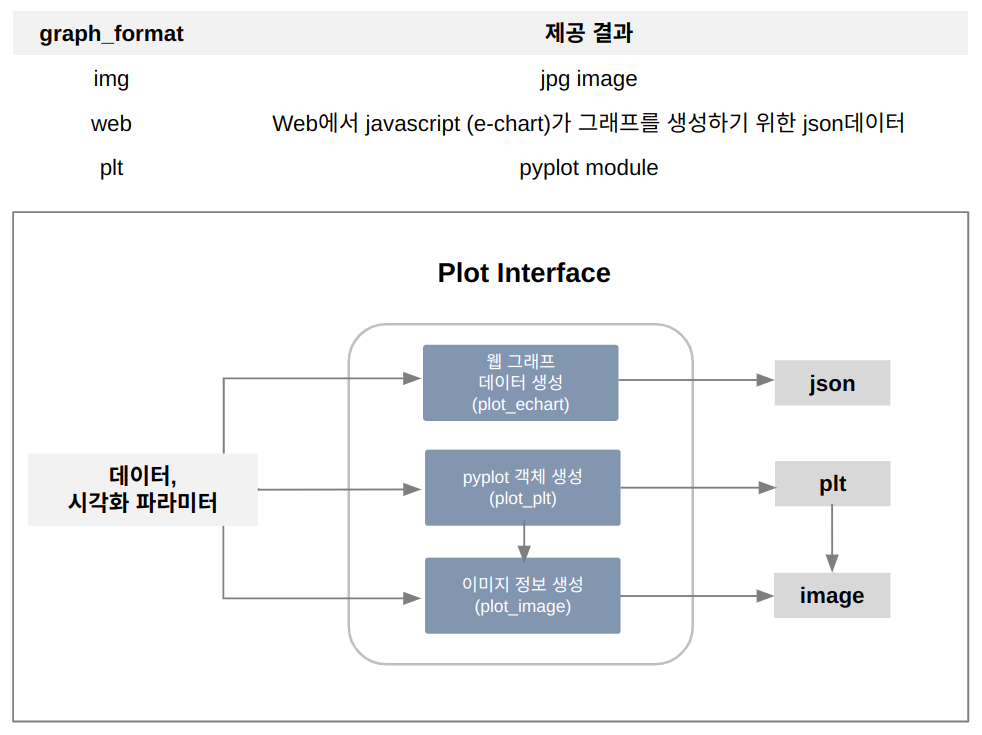
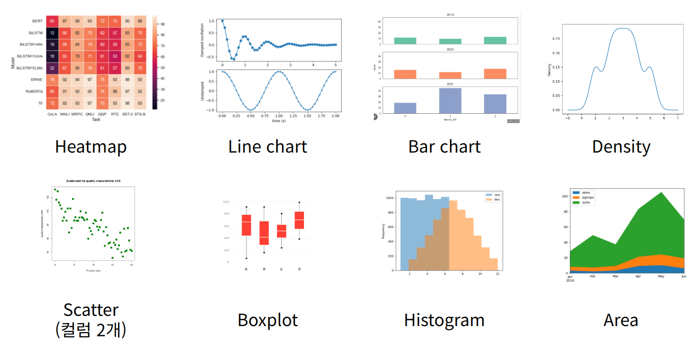

Clust: tool
=================================
CLUST tool 패키지에는 CLUST Platform 여러 곳에서 공통으로 활용하는 기능들인 
File 관련, Plot 관련, 분석 테이블 생성 관련 모듈이 존재한다.

|

File Module
----------------------------------------------------------
파일 처리에 대한 기능을 제공한다.

- Features
   - 파일 경로의 존재 유무 확인 (check_path)
   - 파일 경로 String 반환  (get_user_file_path)

|

Plot Module (interface)
----------------------------------------------------------
데이터 혹은 그 분석 결과를 여러가지 타입과 포맷으로 시각화하기 위한 필요 기능들을 제공한다.

|

   [그림. plot_interface 기능]

Plot Interface
^^^^^^^^^^^^^^^^^^^^^^^^^^^^^^^^^^^^^^^^^^^^^
결과 시각화를 위한 사용자 지정 파라미터와 데이터 프레임을 바탕으로 각 포맷에 따른 시각화 결과를 생성한다.
시용자 지정 파라미터에 따라 echart tool, plt tool, image tool를 활용한다.

|

   [그림. 각 graph_format 파라미터에 따른 결과 생성 과정]

|

   [그림. 각 graph_type 파라미터에 따른 결과 그래프 이미지]

Plot Plt
^^^^^^^^^^^^^^^^^^^^^^^^^^^^^^^^^^^^^^^^^^^^^
파이썬 pyplot 용 객체 plt를 생성할 때 활용하는 툴이다.

.. list-table:: 
   :widths: auto
   :header-rows: 1

   * - Parameter
     - Description

   * - Input
     - graph_format, graph_typ, df, Param

   * - Output
     - plt

Plot Echart
^^^^^^^^^^^^^^^^^^^^^^^^^^^^^^^^^^^^^^^^^^^^^
javascript E-chart 그래프 생성 관련 툴이다. 
사용자 지정 graph type에 따라 데이터 프레임을 json 형태로 가공하여 리턴하는 기능을 제공한다.
가공된 json은 E-chart 라이브러리에서 그래프 생성에 활용한다.

.. list-table:: 
   :widths: auto
   :header-rows: 1

   * - Parameter
     - Description

   * - Input
     - graph_format, graph_typ, df, Param

   * - Output
     - result_json

Plot Image
^^^^^^^^^^^^^^^^^^^^^^^^^^^^^^^^^^^^^^^^^^^^^
직접 jpg 이미지를 사용자에게 전달하는 툴이다. 사용자 지정 graph type에 따라 plt 이미지를 생성하고, 
이미지를 byte string으로 변환 후 리턴하는 기능을 제공한다.

.. list-table:: 
   :widths: auto
   :header-rows: 1

   * - Parameter
     - Description

   * - Input
     - graph_format, graph_typ, df, Param

   * - Output
     - base64_jpgData

|

Plot Module (ETC)
----------------------------------------------------------

Plot feature
^^^^^^^^^^^^^^^^^^^^^^^^^^^^^^^^^^^^^^^^^^^^^
특정 조건 및 입력에 따라 plt를 생성하는 툴이다.

Plot two data
^^^^^^^^^^^^^^^^^^^^^^^^^^^^^^^^^^^^^^^^^^^^^
두 개의 컬럼에 대해서 비교하는 시계열 데이터를 생성한다. 보통 머신러닝 후 실제 데이터와 예측된 데이터를 비교하기 위해 쓰인다.

**Input Parameter Example**

- graph type : 그래프 모양을 결정하는 파라미터

::
   
   ['heat_map' | 'line_chart' | 'bar_chart' | 'scatter' | 'box_plot' |'histogram'| 'area'|'density'] 

**Input Parameter Example**

- graph format : 그래프 형식을 결정하는 파라미터

::

   ['web' | 'image' | 'plt' ] 

|

Stats Table Module
----------------------------------------------------------
데이터를 통계적으로 분석하고 그 결과를 테이블로 제공하는 기능을 모아둔 패키지이다.

Correlation
^^^^^^^^^^^^^^^^^^^^^^^^^^^^^^^^^^^^^^^^^^^^^
데이터에 대한 상관 관계를 도출하는 도구를 모아둔 클래스이다.

Metrics
^^^^^^^^^^^^^^^^^^^^^^^^^^^^^^^^^^^^^^^^^^^^^
기계 학습 성능 비교를 위한 Metrics 생성 함수를 제공한다.

timelagCorr
^^^^^^^^^^^^^^^^^^^^^^^^^^^^^^^^^^^^^^^^^^^^^
TimeLag Correlation을 생성하는 기능을 제공하는 클래스이다.

|

Packages
-----------------------------

.. toctree::
   :maxdepth: 2

   tool/tool.file_module
   tool/tool.plot
   tool/tool.stats_table