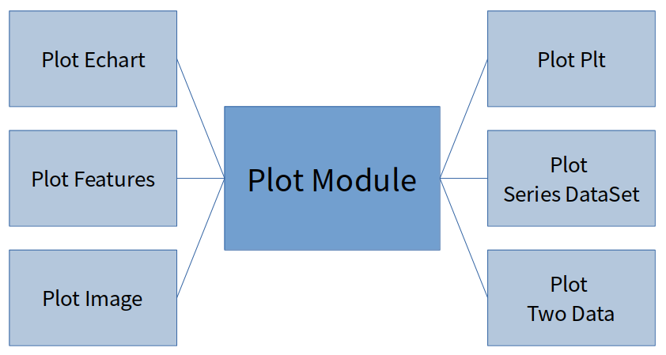

Clust: tool
=================================
CLUST tool 패키지에는 CLUST Platform 여러 곳에서 공통으로 활용하는 기능들인 
File 관련, Plot 관련, 분석 테이블 생성 관련 모듈이 존재한다.

|
File Module
----------------------------------------------------------
파일 경로 확인 및 경로 String 반환 기능을 제공한다.

|
Plot Module
----------------------------------------------------------
데이터 분석 결과를 그래프로 시각화할 때 필요한 기능들을 제공한다.

   Plot Module

Plot Interface
^^^^^^^^^^^^^^^^^^^^^^^^^^^^^^^^^^^^^^^^^^^^^
결과 시각화를 위한 사용자 지정 파라미터는 해당 인터페이스를 통과한다.
시용자 지정에 따라 echart tool, plot tool, image tool 등 활용 툴이 달라진다.

Plot Echart
^^^^^^^^^^^^^^^^^^^^^^^^^^^^^^^^^^^^^^^^^^^^^
javascript E-chart 그래프 생성 관련 툴이다.
사용자 지정 graph type에 따라 데이터 프레임을 json 형태로 가공하여 리턴하는 기능을 제공한다.

**Input Parameter**

- graph type

::

   ['heat_map' | 'line_chart' | 'bar_chart' | 'scatter' | 'box_plot' | 'histogram' | 'area' | 'density'] 

Plot Plt
^^^^^^^^^^^^^^^^^^^^^^^^^^^^^^^^^^^^^^^^^^^^^
pyplot 생성을 위한 툴이다. 사용자 지정 graph type에 따라 plt를 생성한 후 리턴하는 기능을 제공한다.

**Input Parameter**

- graph type

::
   
   ['heat_map' | 'line_chart' | 'bar_chart' | 'scatter' | 'box_plot' |'histogram'| 'area'|'density'] 

Plot Image
^^^^^^^^^^^^^^^^^^^^^^^^^^^^^^^^^^^^^^^^^^^^^
pyplot 이미지 관련 툴이다. 사용자 지정 graph type에 따라 plt 이미지를 생성하고, 이미지를
byte string으로 변환 후 리턴하는 기능을 제공한다.

Plot feature
^^^^^^^^^^^^^^^^^^^^^^^^^^^^^^^^^^^^^^^^^^^^^
pyplot feature 관련 툴이다.

Plot seriesDataSet
^^^^^^^^^^^^^^^^^^^^^^^^^^^^^^^^^^^^^^^^^^^^^
pyplot seriesDataSet 관련 함수를 제공한다.
(현재 사용하지 않는 툴 2023.11.23 기준)

Plot two data
^^^^^^^^^^^^^^^^^^^^^^^^^^^^^^^^^^^^^^^^^^^^^
pyplot 데이터 predictions 함수를 제공한다.

|
Stats Table Module
----------------------------------------------------------
데이터의 상관관계를 구하고 테이블을 제공하는 기능을 모아둔 패키지이다.

Correlation
^^^^^^^^^^^^^^^^^^^^^^^^^^^^^^^^^^^^^^^^^^^^^
Correlation 기능을 모아둔 클래스이다.

Metrics
^^^^^^^^^^^^^^^^^^^^^^^^^^^^^^^^^^^^^^^^^^^^^
Metrics 관련 함수들을 모아두었다.

timelagCorr
^^^^^^^^^^^^^^^^^^^^^^^^^^^^^^^^^^^^^^^^^^^^^
TimeLag Correlation 기능을 모아둔 클래스이다.

|
Packages
-----------------------------

.. toctree::
   :maxdepth: 2

   tool/tool.file_module
   tool/tool.plot
   tool/tool.stats_table