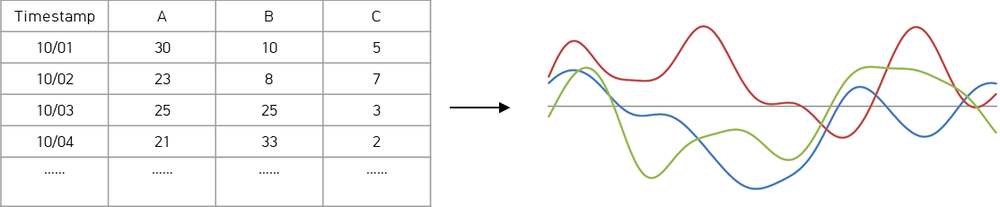
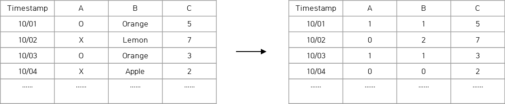

Clust: transformation
=================================

Transformation
----------------------------------------------------------

Purpose
^^^^^^^^^^^^^^^^^^^^^^^^^^^^^^^^^
시계열 데이터는 아래와 같이 시간에 따른 축과 각 피쳐들 (ex. A, B, C)의 결합에 의한 테이블 형태로 단순화시킬 수 있다. 
그러나 각 피쳐들이 너무 과도하게 많거나 혹은 각각의 Feature들의 데이터 값이 중요한 정보 값을 버리고 있을 경우 (ex. A가 높은 시점은 대부분 각달의 초순경이다.)가 많기 때문에 
이와 같은 데이터를 적절히 Extension (확장), Reduction (축소), Extraction (축출)할 필요가 있다.

|

|

또한 일반 데이터들과 마찬가지로 시계열 데이터 또한 학습에 용이한 형태 (One Hot Encoding, labeling 등) 로 데이터를 변환 하여야 한다.

|

|

그밖의 시간 및 일, 월, 년의 주기별 시간 스탬프의 값을 또 다른 피쳐로 나타내거나 (오전/오후, 혹은 삼각함수를 이용한 주기 값) 데이터를 부분 통계화 하여 다시 피쳐로 활용할 수 있고, 
데이터를 전혀 다른 피쳐와 축의 차원으로 변환하는 기법도 쓰이기 때문에 이와 같은 전처리기 가능한 패키지들에 대해 구성하여 제공한다.

|

Functions
^^^^^^^^^^^^^^^^^^^^^^^^^^^^^^^^^
크게 다음과 같은 기능이 제공된다.

- Feature Extension
- Feature Reduction
- Sampling
- Split (Condition)
- Split (Cycle)
- Entropy
- Format Transformation
- General Method

|

Integration Interface
----------------------------------------------------------

Feature Extension
^^^^^^^^^^^^^^^^^^^^^^^^^^^^^^^^^
원래 존재하는 시계열 데이터의 Feature를 확장하는 기능을 제공하며 현재는 Use-case에 필요한 Feature Extension 기법만 제공되고 있으나 이를 개선할 예정이다.

- EncodedFefatureExtension:원래 존재하는 데이터를 Encoding하여 피쳐를 확장
- ETCFeatureExtension: 레벨과 라벨 정보에 따른 피쳐 확장, 벡터로 변환 가능한 피쳐 확장, 데이터의 비율에 따른 피쳐 확장 기능 제공
- PeriodicFeatureExtension: 시간 같은 주기적으로 반복되는 피쳐나 타임스탬프에 대해서 주기에 의거하여 값으로 변환함. 삼각함수 사용
- TimeFeatureExtension: 시간 정보에 따라 요일, 시간, 날짜, 달, 주에 대한 정보를 축출하여 피쳐로 확장함. 또한 업무 비업무 시간에 대한 정보를 축출하여 피쳐로 확장. 한국과 미국 등의 휴일 정보에 대한 피쳐 확장 등 날짜를 기반한 피쳐를 확장함
- TimeLagFeatureExtension:시간 정보를 Lag함에 따라 산출되는 데이터에 관련한 Feature를 확장함

Feature Reduction
^^^^^^^^^^^^^^^^^^^^^^^^^^^^^^^^^
피쳐를 적절한 방법으로 수를 줄이는 방법으로 PCA, TSNE와 같은 알고리즘을 적용하며, 그밖의 다른 방법에 대한 확장할 계획이다.

Sampling
^^^^^^^^^^^^^^^^^^^^^^^^^^^^^^^^^
피쳐를 Up and Down 샘플링하여 변환한다.

Split (Condition)
^^^^^^^^^^^^^^^^^^^^^^^^^^^^^^^^^
시계열 데이터를 규칙에 의거하여 나눈다.

- holiday:데이터를 평일과 주말로 나눈후 한국 기반 공휴일과 주말 데이터를 섞어 궁극적으로 시계열 데이터를 평일 중 공휴일이 빠진 데이터 셋과, 공휴일과 주말을 섞은 데이터셋으로 분리
- timestep: 24시간의 시간에 대해서 나누어 데이터를 분리. 예를 들어 시간을 아침, 오후, 저녁으로 나누고 12시 이전까지는 아침, 18시 이전까지는 오후 그 외 시간은 저녁으로 나눌 수 있음. 사용자가 적절한 데이터 레벨과 라벨 값을 입력하면 이에 근거하여 데이터가 나뉘며 0~24시간을 기준함
- working: holiday 중 업무 시간까지 고려한 데이터를 생성함 즉 주말과 공휴일을 뺀 나머지 일정 중 업무 시간을 고려하여 레이블링하며 각각의 레이블링에 대해서 복수로 부여할 수 있음

Split (Cycle)
^^^^^^^^^^^^^^^^^^^^^^^^^^^^^^^^^
데이터를 정해진 주기(초, 분, 시, 일, 주, 월, 년)에 의거하여 분리한다.

Entropy
^^^^^^^^^^^^^^^^^^^^^^^^^^^^^^^^^
시계열 데이터의 정상 및 비정상 등의 분류 문제 성능을 높이기 위해서 데이터의 Entropy를 조정하여 더 극정인 데이터로 변환하고 이를 기반하여 학습에 활용한다. 

Type
^^^^^^^^^^^^^^^^^^^^^^^^^^^^^^^^^
데이터 프레임을 어레이 형태로, 또 그 반대의 경우에 대해서 Type을 변경하여 데이터를 변환한다. 현재는 사용자 케이스에 맞게만 변환되는 함수를 제공하며 이후 확장할 예정이다.

General Method
^^^^^^^^^^^^^^^^^^^^^^^^^^^^^^^^^
시계열 데이터를 다룰때 필요한 그밖의 데이터 변환에 대한 방법을 제공한다.

- basicTransform:스케일링, 연관도 분석 등 다양한 트랜스폼 기법 지원
- data_scaler: 데이터 스케일링 뿐만 아니라 생성된 스케일러를 저장하고 로드하는 기법 지원
- flatten_interface: 여러 피쳐의 시계열 데이터를 플랫하게 변환하는 기법 지원
- select_interface: 여러 시계열 데이터 셋 중 필요한 시계열 데이터 집합만 선택하는 인터페이스 지원
- split_interface: 시계열 데이터를 여러개로 쪼개어 활용하기 위한 인터페이스 지원

|

Packages
-----------------------------

.. toctree::
   :maxdepth: 2

   transformation/transformation.entropy
   transformation/transformation.featureExtension
   transformation/transformation.featureReduction
   transformation/transformation.general
   transformation/transformation.purpose
   transformation/transformation.sampling
   transformation/transformation.splitDataByCondition
   transformation/transformation.splitDataByCycle
   transformation/transformation.type

